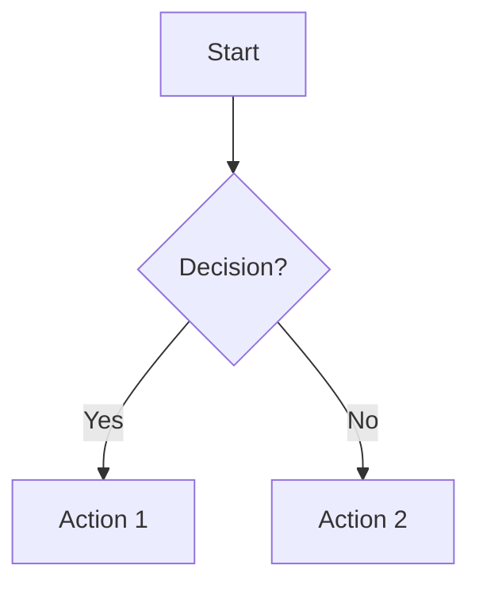
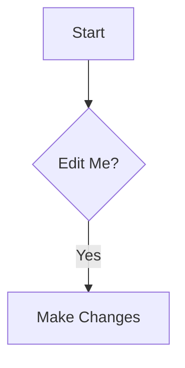
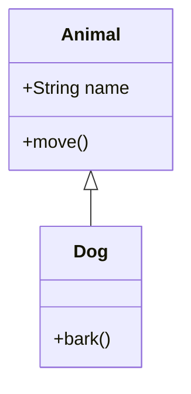
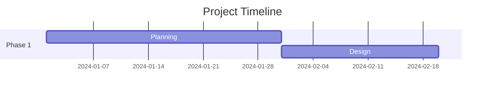
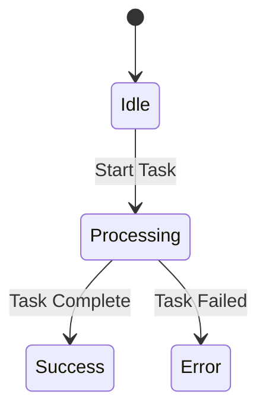
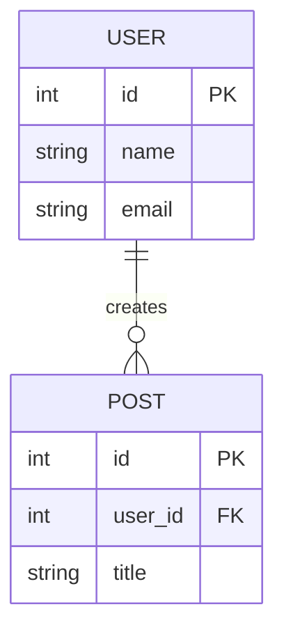
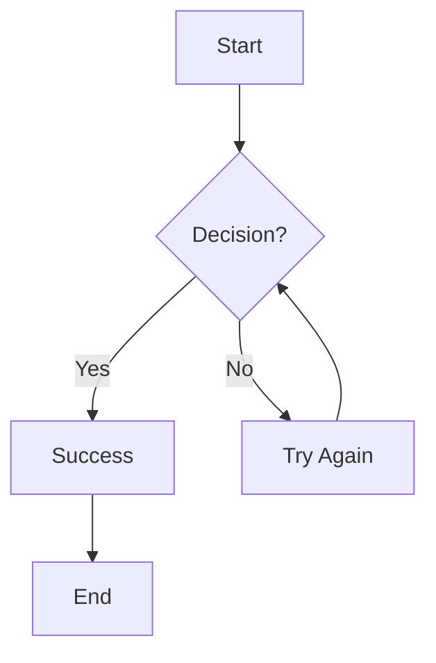

# Mermaid Diagram Features - sparrow-ai-tech

This document provides a comprehensive overview of the Mermaid diagram features
implemented in the sparrow-ai-tech project, following the best practices
outlined in the project's architectural documentation.

## 🎯 Overview

The sparrow-ai-tech platform provides a complete Mermaid diagram solution with:

- **Server-Side Rendering (SSR)** for production performance
- **Interactive Live Editor** for diagram creation and editing
- **Comprehensive Markdown Support** with Mermaid code fences
- **Multiple Diagram Types** including flowcharts, sequence diagrams, class
  diagrams, and more
- **Accessibility Features** and responsive design
- **Export Capabilities** for SVG and code sharing

## 🏗️ Architecture

### Rendering Strategy

The project implements a **hybrid rendering approach**:

1. **SSR (Server-Side Rendering)** - Primary method for production
   - Uses `rehype-mermaid` plugin with Playwright
   - Generates static SVG during build time
   - No client-side JavaScript overhead
   - SEO-friendly and fast loading

2. **CSR (Client-Side Rendering)** - For interactive editors
   - Used in the live editor for real-time preview
   - Dynamic diagram updates
   - Fallback for SSR when needed

### Key Components

- `MermaidLiveEditor.jsx` - Interactive editor component
- `Mermaid.astro` - Static diagram component
- `MarkdownViewer.jsx` - Markdown renderer with Mermaid support
- `mermaid-editor.astro` - Dedicated editor page
- `markdown-test.astro` - Test page for diagram features

## 🚀 Features

### 1. Interactive Live Editor

**Location**: `/mermaid-editor`

**Features**:

- Real-time preview with syntax highlighting
- Built-in examples for different diagram types
- Error handling and validation
- Export to SVG format
- GitHub integration for loading diagrams
- Keyboard shortcuts (Ctrl+Enter to update)
- Responsive design for mobile and desktop

**Usage**:

```jsx
<MermaidLiveEditor
  initialCode={defaultCode}
  readOnly={false}
  onCodeChange={handleCodeChange}
/>
```

### 2. Markdown Integration

**Supported Syntax**:

````markdown

````



````

**Features**:
- Automatic rendering of `mermaid` code fences
- Editable diagrams with `mermaid-edit` syntax
- Error handling and loading states
- Responsive design

### 3. Diagram Types Supported

The platform supports all major Mermaid diagram types:

#### Flowcharts
```mermaid
graph TD
    A[Start] --> B{Decision?};
    B -->|Yes| C[Action 1];
    B -->|No| D[Action 2];
````

#### Sequence Diagrams

```mermaid
sequenceDiagram
    participant User
    participant System
    participant Database

    User->>System: Request Data
    System->>Database: Query
    Database-->>System: Results
    System-->>User: Response
```

#### Class Diagrams



#### Gantt Charts



#### State Diagrams



#### Entity Relationship Diagrams



#### And many more...

- Pie Charts
- Git Graphs
- Journey Diagrams
- Mindmaps
- Timelines
- C4 Context Diagrams

### 4. Accessibility Features

- **Keyboard Navigation**: All controls are keyboard accessible
- **Screen Reader Support**: Proper ARIA labels and roles
- **Focus Management**: Clear focus states and indicators
- **Error Handling**: Accessible error messages
- **Responsive Design**: Works on all device sizes

### 5. Export and Sharing

- **SVG Export**: Download diagrams as SVG files
- **Code Copy**: Copy Mermaid syntax to clipboard
- **GitHub Integration**: Load diagrams from repositories
- **URL Sharing**: Share diagram URLs with parameters

## 🛠️ Technical Implementation

### Dependencies

```json
{
  "dependencies": {
    "mermaid": "^11.9.0"
  },
  "devDependencies": {
    "rehype-mermaid": "^latest",
    "playwright": "^latest"
  }
}
```

### Configuration

**Astro Configuration** (`astro.config.mjs`):

```javascript
import rehypeMermaid from 'rehype-mermaid';

export default defineConfig({
  markdown: {
    rehypePlugins: [
      [
        rehypeMermaid,
        {
          strategy: 'inline-svg',
        },
      ],
    ],
  },
});
```

**Package.json Scripts**:

```json
{
  "scripts": {
    "postinstall": "npx playwright install --with-deps"
  }
}
```

### Build Process

1. **Pre-build**: Playwright browsers are installed
2. **Build**: Mermaid diagrams are rendered to SVG during build
3. **Deploy**: Static SVG files are served to users

## 📱 Usage Examples

### Basic Diagram in Markdown

Create a file with `.md` extension:

````markdown
# My Documentation

Here's a simple flowchart:


````

This will be automatically rendered as a diagram.

````

### Interactive Editor

Visit `/mermaid-editor` to use the interactive editor:

1. Choose an example from the dropdown
2. Edit the code in the left panel
3. See real-time preview in the right panel
4. Export as SVG or copy the code

### Programmatic Usage

```jsx
import MermaidLiveEditor from '../components/markdown/MermaidLiveEditor.jsx';

function MyComponent() {
  const handleCodeChange = (code) => {
    console.log('Diagram code changed:', code);
  };

  return (
    <MermaidLiveEditor
      initialCode="graph TD\nA[Start] --> B[End]"
      onCodeChange={handleCodeChange}
    />
  );
}
````

## 🧪 Testing

### Test Pages

- `/mermaid-editor` - Interactive editor
- `/markdown-test` - Markdown rendering test
- `/markdown-test?src=./articles/mermaid-test.md` - Comprehensive examples

### Test Files

- `public/articles/mermaid-test.md` - Comprehensive diagram examples
- `src/pages/markdown-test.astro` - Test page for markdown rendering

### Cypress Tests

The project includes E2E tests for Mermaid features:

```javascript
// Example test
it('renders mermaid diagram', () => {
  cy.visit('/markdown-test?src=./articles/mermaid-test.md');
  cy.get('.mermaid-diagram').find('svg').should('exist');
});
```

## 🔧 Customization

### Themes

The Mermaid editor supports multiple themes:

```javascript
mermaid.initialize({
  theme: 'default', // or 'dark', 'forest', 'neutral'
  themeVariables: {
    primaryColor: '#4facfe',
    primaryTextColor: '#333',
    primaryBorderColor: '#007bff',
  },
});
```

### Styling

Custom CSS can be applied to diagram containers:

```css
.mermaid-container {
  border: 1px solid #e2e8f0;
  border-radius: 0.75rem;
  padding: 1.5rem;
  background: #fafafa;
}
```

### Configuration Options

```javascript
// Mermaid initialization options
mermaid.initialize({
  startOnLoad: false,
  flowchart: {
    useMaxWidth: true,
    htmlLabels: true,
    curve: 'basis',
  },
  sequence: {
    diagramMarginX: 50,
    diagramMarginY: 10,
  },
});
```

## 🚀 Performance

### SSR Benefits

- **Fast Loading**: No client-side JavaScript required
- **SEO Friendly**: Diagrams are visible to search engines
- **Consistent Rendering**: Same output across all environments
- **Reduced Bundle Size**: No Mermaid library in client bundle

### Optimization Tips

1. **Use SSR for Production**: Static diagrams render faster
2. **Limit Interactive Diagrams**: Use sparingly for better performance
3. **Optimize SVG**: Remove unnecessary attributes and metadata
4. **Lazy Loading**: Load diagrams only when needed

## 🔒 Security

### Input Sanitization

- All user input is validated and sanitized
- SVG output is cleaned to prevent XSS attacks
- Playwright runs in sandboxed environment

### Best Practices

1. **Validate Input**: Check diagram syntax before rendering
2. **Sanitize Output**: Clean SVG before serving to clients
3. **Rate Limiting**: Prevent abuse of rendering services
4. **Error Handling**: Graceful handling of malformed diagrams

## 📚 Resources

### Documentation

- [Mermaid Official Documentation](https://mermaid.js.org/)
- [rehype-mermaid Plugin](https://github.com/remcohaszing/rehype-mermaid)
- [Astro Markdown Documentation](https://docs.astro.build/en/guides/markdown-content/)

### Examples

- `/mermaid-editor` - Interactive examples
- `public/articles/mermaid-test.md` - Comprehensive examples
- [Mermaid Live Editor](https://mermaid.live/) - Official online editor

### Community

- [Mermaid GitHub Repository](https://github.com/mermaid-js/mermaid)
- [Mermaid Discussions](https://github.com/mermaid-js/mermaid/discussions)
- [Astro Community](https://astro.build/community/)

## 🤝 Contributing

To contribute to the Mermaid features:

1. Follow the project's coding standards
2. Add tests for new features
3. Update documentation
4. Ensure accessibility compliance
5. Test on multiple devices and browsers

## 📄 License

This implementation follows the same license as the main project. Mermaid itself
is licensed under the MIT License.

---

For more information about the sparrow-ai-tech project, visit the main
documentation or the project repository.
