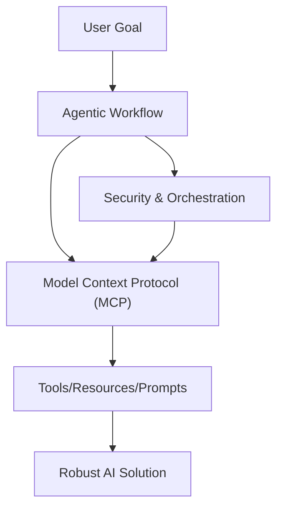
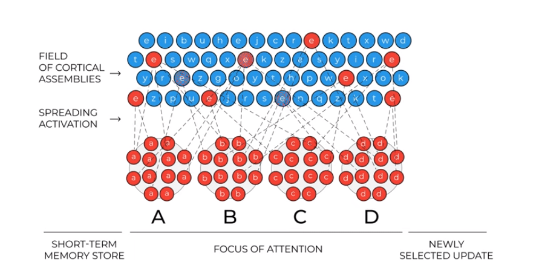
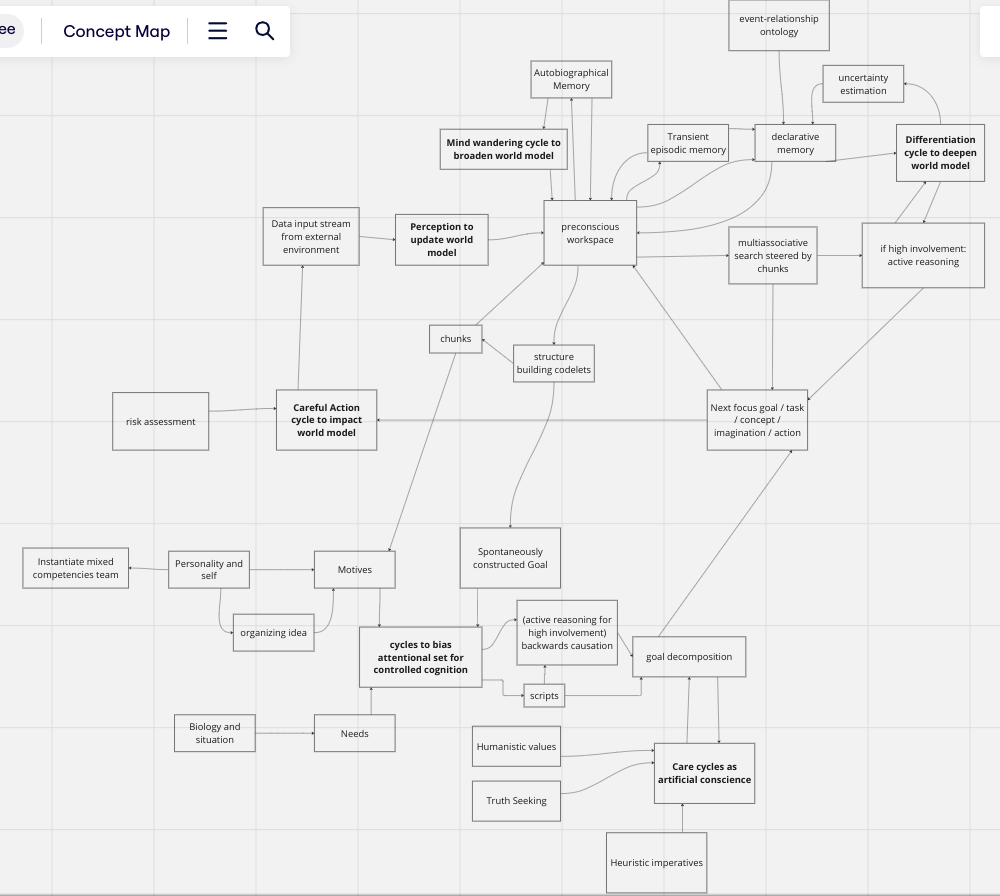
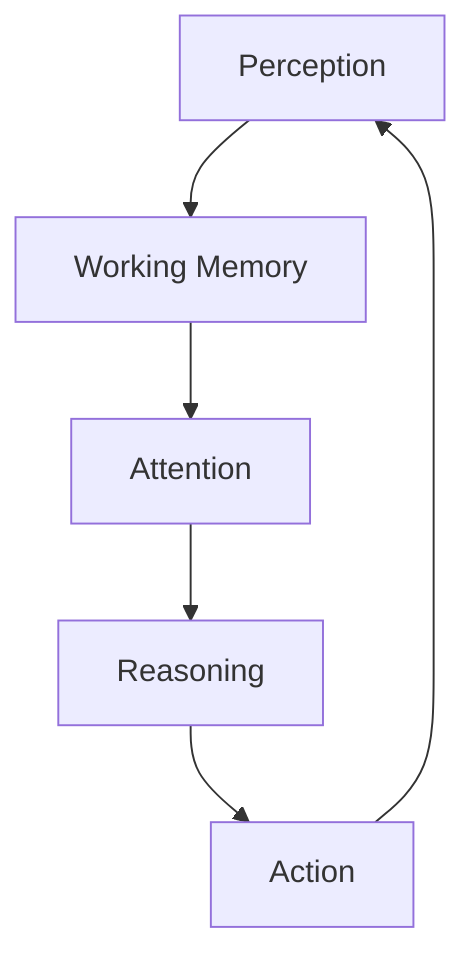
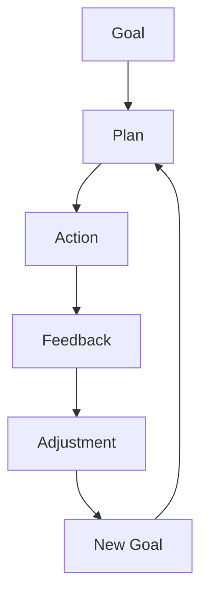

# Portfolio Significance

This article is part of the sparesparrow/Sparrow AI & Tech portfolio, which is dedicated to advancing the theory and practice of agentic AI. The cognitive architectures and active reasoning concepts discussed here directly inform the design of secure, interoperable, and scalable agentic workflows, as implemented in the MCP ecosystem and related projects. This work demonstrates leadership in bridging theory and practice for next-generation AI systems.

---

## Agentic Workflow, MCP, and Secure Orchestration

_Figure: Agentic workflows leverage MCP and secure orchestration to deliver robust, adaptive AI solutions._

---

# Towards Actively Reasoning LLM Systems

_By Knut Jägersberg, adapted and summarized for sparrow-ai-tech_

---

## Introduction

This article explores the intersection of foundation models, cognitive architectures, and compound systems, aiming for a form of artificial general intelligence (AGI) or "artificial human intelligence." We discuss:

- Requirements of a thinking machine
- An LLM-based cognitive architecture
- Active reasoning

---

## Iterative Updating Theory of Working Memory (Reser, 2023)

The evolution of the next focus of attention can be seen as a similarity search within associations in long-term memory. Working memory acts as a sophisticated content recommendation engine, operating along a continuum between system 1 and system 2, with system 2 emerging from system 1.

---

## What is Called Thinking?

Thinking is the product of mental activity, including perception, memory, decision making, judgment, and action. Reasoning is not limited to logic; it also includes perception and imagination. Logical reasoning emerges from convergence towards new abstractions, supported by quality world knowledge.

---

## LIDA-Inspired Blended Cognitive Architecture

LIDA theory describes cognition as a repetitive cycle of perception, understanding, and action. The mind operates by recommending what to think about next, with focus of attention being self-organizing.

---

## Working Definitions of Intelligence

- **Intelligence**: The ability to choose between different options and adapt to the environment with insufficient knowledge and resources (Wang, 2019).
- **General Intelligence**: Complex, self-organizing systems that recognize and form patterns in themselves and their environments (Goertzel, 2021).

---

## Cascade of Control Model of Executive Functions (Banich, 2009)

Steering attention is achieved by emergent and strategic biasing of activation for problem framing and solving. Items in short-term working memory influence the next focus of attention, retrieved from long-term memory.

---

## LLM-Based Cognitive Architecture

_Figure: An LLM-based cognitive architecture cycles through perception, memory, attention, reasoning, and action._

---

## Active Reasoning Feedback Loop

_Figure: Active reasoning involves iterative planning, action, feedback, and goal adjustment._

---

## Active Reasoning

Active reasoning ensures outputs comply with world knowledge criteria. It involves:

- Propositional reasoning via chains of transformations
- Self-organizing retrieval and association of facts and templates
- Differentiation: using existing knowledge to place new combinations into the body of knowledge

---

## Example: Learning to Differentiate, Intentionally

The process involves:

1. Self-narration and mind wandering
2. Goal and motive formation
3. Goal decomposition by logical inference
4. Iterative execution and adjustment

Care cycles are integrated for ethical alignment, ensuring the system reasons about ethical implications first.

---

## References

- Banich (2009). Executive Function: The Search for an Integrated Account. [Link](https://sci-hub.yncjkj.com/10.1111/j.1467-8721.2009.01615.x)
- Bottou (2011). From Machine Learning to Machine Reasoning. [arXiv](https://arxiv.org/abs/1102.1808)
- Goertzel (2021). The General Theory of General Intelligence. [arXiv](https://arxiv.org/abs/2103.15100)
- Houdé and Borst (2015). Inhibitory-control theory of the reasoning brain. [Frontiers](https://www.frontiersin.org/articles/10.3389/fnhum.2015.00148/full)
- John et al (2022). Linking dynamical systems with human neuroimaging. [ResearchGate](https://www.researchgate.net/publication/357783628_It's_about_time_Linking_dynamical_systems_with_human_neuroimaging_to_understand_the_brain)
- Kugele & Franklin (2020). Learning in LIDA. [ResearchGate](https://www.researchgate.net/publication/347080823_Learning_in_LIDA)
- Legg & Hutter (2007). A Collection of Definitions of Intelligence. [arXiv](https://arxiv.org/abs/0706.3639)
- Naumenko (2023). Theory of Language as Reflection of World Modeling. [LingBuzz](https://ling.auf.net/lingbuzz/007345)
- Reser (2023). Iterative Updating Model of Working Memory. [YouTube](https://www.youtube.com/watch?v=R2H2Pl0I6EA)
- Suereth (2024). Considering caring as a safeguard in AI. [ScienceDirect](https://www.sciencedirect.com/science/article/pii/S2664329424000025)
- Teig and Scherer (2016). Formal and Informal Reasoning. [NCBI](https://www.ncbi.nlm.nih.gov/pmc/articles/PMC4949208/)
- Wang (2019). On Defining Artificial Intelligence. [Sciendo](https://sciendo.com/article/10.2478/jagi-2019-0002)

---

_For diagrams and further reading, see the original article on [Hugging Face](https://huggingface.co/blog/KnutJaegersberg/active-reasoning)._
