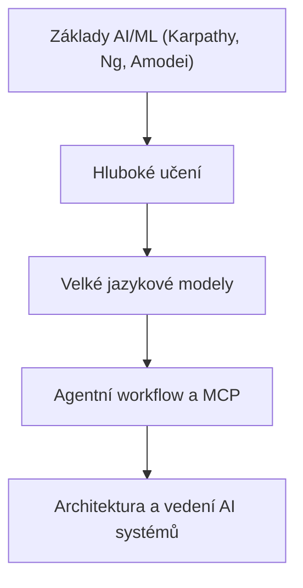
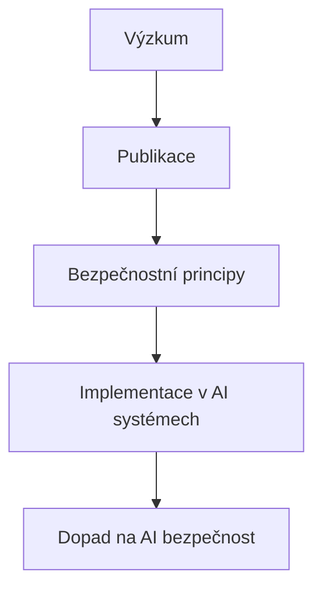
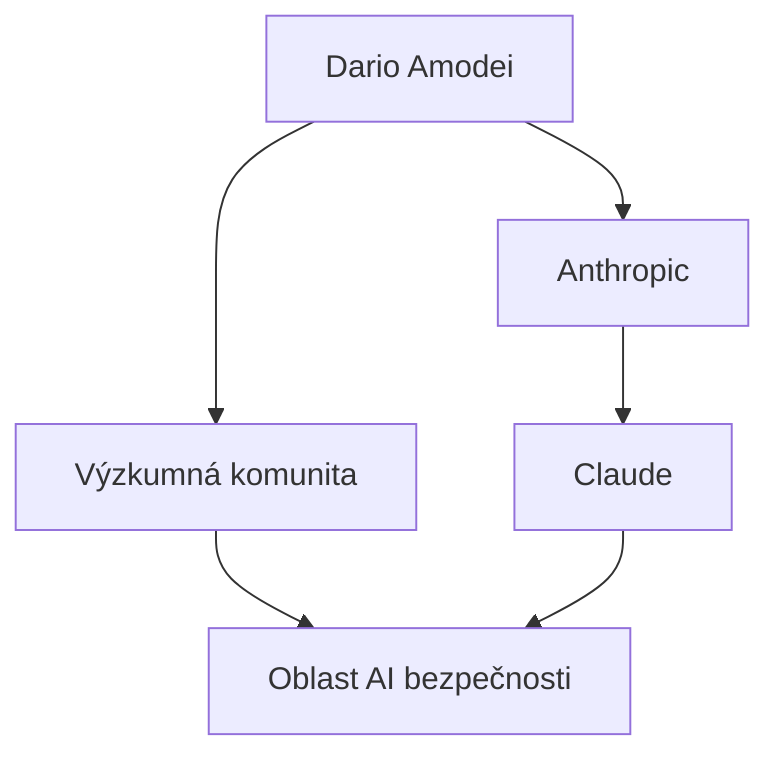

# Portfolio Relevance

This article is part of the sparesparrow/Sparrow AI & Tech portfolio, which is dedicated to building robust, secure, and interoperable agentic AI systems. Understanding the research and safety principles pioneered by Dario Amodei is essential for developing, understanding, and leading the next generation of agentic workflows, MCP-based architectures, and secure AI ecosystems. These skills form the base of the technical skill tree for AI leadership.

---

## Skill Tree: From Foundations to Agentic AI

_Figure: Foundational AI/ML education is the root of the skill tree leading to agentic AI system leadership._

---

# Dario Amodei: Průkopník bezpečné umělé inteligence a jeho klíčové publikace

**Klíčová slova:** Dario Amodei, Anthropic, Claude, bezpečnost AI, alignment, umělá inteligence, výzkum, čeština

---

## Úvod

Dario Amodei je jednou z nejvýznamnějších osobností v oblasti umělé inteligence a bezpečnosti AI. Jako spoluzakladatel a CEO společnosti Anthropic, která vyvinula jazykový model Claude, patří mezi klíčové postavy, které formují budoucnost AI. Tento článek představuje jeho nejdůležitější publikace, výzkum a přínos české AI komunitě.

---

## Dario Amodei: Životopis a kariéra

### Vzdělání a raná kariéra

Dario Amodei získal doktorát z biofyziky na Stanfordově univerzitě, kde se specializoval na výpočetní biologii a strojové učení. Jeho raný výzkum se zaměřoval na modelování proteinových struktur a predikci jejich funkcí pomocí pokročilých algoritmů.

### Přechod do AI průmyslu

Po doktorátu se Dario Amodei připojil k Google Brain, kde pracoval na hlubokém učení a neuronových sítích. Později přešel do OpenAI, kde se podílel na vývoji GPT-2 a dalších jazykových modelů. V roce 2021 spoluzaložil Anthropic s cílem vyvinout bezpečnější a spolehlivější AI systémy.

---

## Klíčové publikace a výzkum

### 1. Constitutional AI: Harmlessness from AI Feedback

**Rok:** 2022  
**Autoři:** Dario Amodei, Daniela Amodei, et al.

#### O čem je publikace?

Tato průlomová práce představuje koncept "Constitutional AI" - nový přístup k trénování jazykových modelů, který klade důraz na bezpečnost a etické chování. Místo tradičního přístupu, kdy se modely trénují na velkých množstvích textu bez ohledu na obsah, Constitutional AI zavádí "ústavu" - soubor principů, které model musí dodržovat.

#### Klíčové principy:

- **Bezpečnost:** Model se učí vyhýbat se škodlivému nebo nebezpečnému obsahu
- **Pomocnost:** Model se zaměřuje na užitečné a konstruktivní odpovědi
- **Poctivost:** Model se učí být transparentní o svých omezeních a nejistotách

#### Význam pro českou AI komunitu:

Tento přístup je zvláště relevantní pro vývojáře, kteří chtějí vytvářet AI systémy, které jsou bezpečné a užitečné pro české uživatele. Constitutional AI poskytuje framework pro trénování modelů, které respektují lokální kulturní a jazykové kontexty.

### 2. AI Safety Research

Dario Amodei je autorem nebo spoluautorem řady článků o bezpečnosti AI, které se zaměřují na:

- **Alignment problém:** Jak zajistit, aby AI systémy sledovaly lidské hodnoty a cíle
- **Robustnost:** Jak vytvořit AI systémy, které jsou odolné vůči manipulaci a chybám
- **Transparentnost:** Jak lépe pochopit, jak AI systémy dospívají ke svým rozhodnutím

### 3. Scaling Laws for Neural Language Models

**Rok:** 2020  
**Autoři:** Jared Kaplan, Sam McCandlish, Tom Henighan, Dario Amodei, et al.

#### Obsah publikace:

Tato práce zkoumá, jak se výkon jazykových modelů mění s velikostí modelu, množstvím trénovacích dat a výpočetními zdroji. Výzkumníci objevili "škálovací zákony", které pomáhají předpovědět, jak bude model fungovat při různých úrovních škálování.

#### Praktický význam:

Tyto poznatky jsou klíčové pro vývojáře, kteří chtějí optimalizovat své AI modely pro konkrétní aplikace a dostupné zdroje. Pomáhají při plánování architektury modelů a alokaci výpočetních zdrojů.

---

## Anthropic a Claude

### Spoluzaložení Anthropic

V roce 2021 Dario Amodei spoluzaložil Anthropic s cílem vyvinout AI systémy, které jsou "bezpečné, užitečné a poctivé". Společnost se zaměřuje na výzkum a vývoj jazykových modelů, které jsou navrženy s ohledem na bezpečnost a etiku.

### Claude: Bezpečný jazykový model

Claude je vlajkový produkt Anthropic, který představuje nový standard v bezpečnosti a užitečnosti jazykových modelů. Model je trénován pomocí Constitutional AI přístupu, což znamená, že:

- **Vyhýbá se škodlivému obsahu:** Claude je navržen tak, aby neprodukoval nebezpečné nebo škodlivé informace
- **Je transparentní:** Model je otevřený ohledně svých omezení a nejistot
- **Respektuje soukromí:** Claude je navržen s ohledem na ochranu osobních údajů

---

## Dopad na českou AI komunitu

### Proč je práce Daria Amodeiho důležitá?

- **Bezpečnostní standardy:** Jeho výzkum poskytuje framework pro vývoj bezpečných AI systémů v češtině
- **Etické AI:** Constitutional AI přístup pomáhá vytvářet AI systémy, které respektují české kulturní hodnoty
- **Praktické aplikace:** Jeho poznatky o škálování a bezpečnosti jsou aplikovatelné na lokální AI projekty

### Doporučené zdroje pro další studium

- [Anthropic Research Papers](https://www.anthropic.com/research)
- [Constitutional AI Paper](https://arxiv.org/abs/2212.08073)
- [Scaling Laws Paper](https://arxiv.org/abs/2001.08361)
- [Dario Amodei na Twitteru](https://twitter.com/darioamodei)

---

## Závěr

Dario Amodei představuje novou generaci AI výzkumníků a podnikatelů, kteří kladou důraz na bezpečnost a etiku. Jeho práce na Constitutional AI a bezpečnosti jazykových modelů poskytuje cenné poznatky pro českou AI komunitu a pomáhá formovat budoucnost bezpečné a užitečné umělé inteligence.

---

**Odkazy:**

- [Anthropic oficiální web](https://www.anthropic.com/)
- [Claude AI](https://claude.ai/)
- [Anthropic Research](https://www.anthropic.com/research)

---

_Článek připraven pro šíření znalostí v české AI komunitě. Sdílejte a inspirujte další!_

---

## Výzkumná pipeline: Od výzkumu k bezpečnosti

_Obrázek: Výzkum vede k publikacím, které formují bezpečnostní principy a jejich implementaci v AI._

---

## Síť vlivu Daria Amodeiho

_Obrázek: Dario Amodei ovlivňuje vývoj AI bezpečnosti skrze Anthropic, Claude a výzkumnou komunitu._
