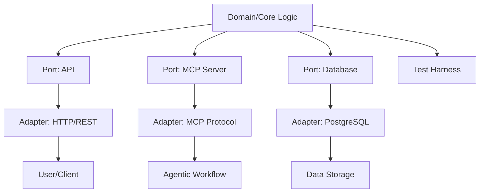
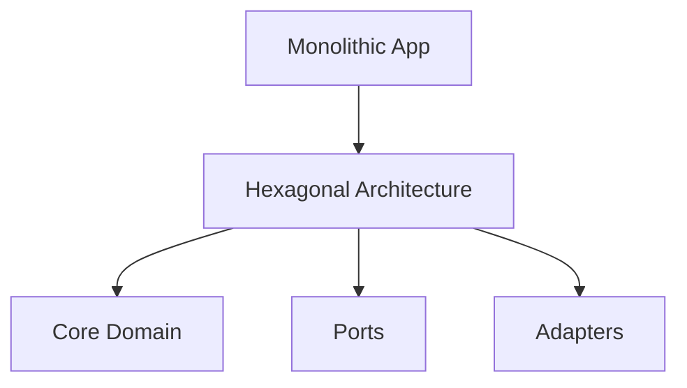
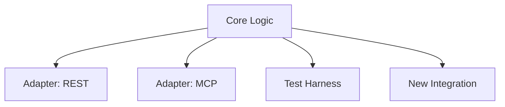

# Portfolio Relevance

This article is part of the sparesparrow/Sparrow AI & Tech portfolio, which is dedicated to building robust, secure, and interoperable agentic AI systems. The use of hexagonal architecture is a key design pattern in the portfolio, enabling modularity, testability, and security for MCP-based agentic workflows. This approach supports scalable, maintainable, and enterprise-grade AI ecosystems.

---

## Hexagonal Architecture in Agentic MCP Systems


*Figure: Hexagonal architecture enables modular, testable, and secure agentic AI systems within the MCP ecosystem.*

---

# Hexagonal Architecture in MCP: Building Flexible and Maintainable AI Systems

**Keywords:** hexagonal architecture, ports and adapters, MCP, Model Context Protocol, software architecture, AI workflow, maintainability, extensibility, open source

---

## What is Hexagonal Architecture?

Hexagonal architecture, also known as the **Ports and Adapters** pattern, is a software design approach that emphasizes separation of concerns, testability, and flexibility. Instead of structuring your application around technical layers (like controllers, services, repositories), you organize it around the core business logic (the "domain") and define clear boundaries for how external systems interact with it.

### Key Concepts:
- **Core Domain:** The heart of your application, containing business rules and logic.
- **Ports:** Interfaces that define how the core communicates with the outside world (e.g., APIs, databases, UIs).
- **Adapters:** Implementations of ports that connect the core to specific technologies (e.g., REST API, file storage, Postgres, third-party services).

---

## Why Use Hexagonal Architecture in MCP?

The Model Context Protocol (MCP) is designed for extensibility, maintainability, and integration with diverse AI tools and workflows. Hexagonal architecture is a perfect fit for MCP because:

- **Decouples Business Logic from Technology:** The core MCP logic (prompt management, semantic search, workflow orchestration) is isolated from frameworks and infrastructure.
- **Easy to Add/Replace Adapters:** Want to switch from file storage to Postgres, or add a new REST API? Just implement a new adapter—no changes to the core.
- **Testability:** The core can be tested in isolation using mock ports, ensuring robust and reliable code.
- **Future-Proof:** As new AI tools and protocols emerge, you can integrate them by adding adapters, not rewriting your core.

---

## Example: Hexagonal Architecture in MCP

Let's break down how MCP leverages this pattern:

### 1. **Core Domain**
- Entities: Prompt, Template, Category, User
- Use Cases: CreatePrompt, SearchPrompts, ManageTemplates, etc.

### 2. **Ports (Interfaces)**
- `PromptRepositoryPort`: Interface for storing/retrieving prompts
- `TemplateEnginePort`: Interface for rendering templates
- `UserAuthPort`: Interface for authentication/authorization

### 3. **Adapters**
- **Primary (Driving):** REST API, MCP protocol, CLI
- **Secondary (Driven):** FileStorageAdapter, PostgresAdapter, EtaTemplatingAdapter, ElevenLabsAdapter

**Diagram:**

```
         [ REST API ]      [ MCP Protocol ]      [ CLI ]
               |                  |                |
           [ Primary Adapters (Ports) ]
               |                  |                |
           +------------------------------------------+
           |           Core Domain (MCP)              |
           +------------------------------------------+
               |                  |                |
      [ FileStorage ]   [ Postgres ]   [ Eta Templating ]
      [ ElevenLabs ]    [ ... ]        [ ... ]
           (Secondary Adapters)
```

---

## Evolution: Monolithic to Hexagonal Architecture


*Figure: Systems evolve from monolithic to modular, hexagonal architectures for flexibility.*

---

## Testability and Extension Points


*Figure: Hexagonal architecture enables easy testing and extension via adapters and harnesses.*

---

## Benefits for AI and Open Source Projects

- **Maintainability:** Isolate changes to specific adapters or the core.
- **Extensibility:** Add new integrations (e.g., new AI APIs, databases) with minimal effort.
- **Community Contributions:** Clear boundaries make it easier for contributors to add features or adapters.
- **Scalability:** Swap out implementations as your project grows (e.g., move from local file storage to cloud database).

---

## Conclusion

Adopting hexagonal architecture in MCP and similar AI projects leads to cleaner, more maintainable, and future-proof codebases. It empowers teams to innovate rapidly, integrate with new tools, and scale their solutions without technical debt.

---

**Want to learn more?**  
- [MCP GitHub Repository](https://github.com/sparesparrow/mcp-prompts)  
- [Hexagonal Architecture Explained (Alistair Cockburn)](https://alistair.cockburn.us/hexagonal-architecture/) 