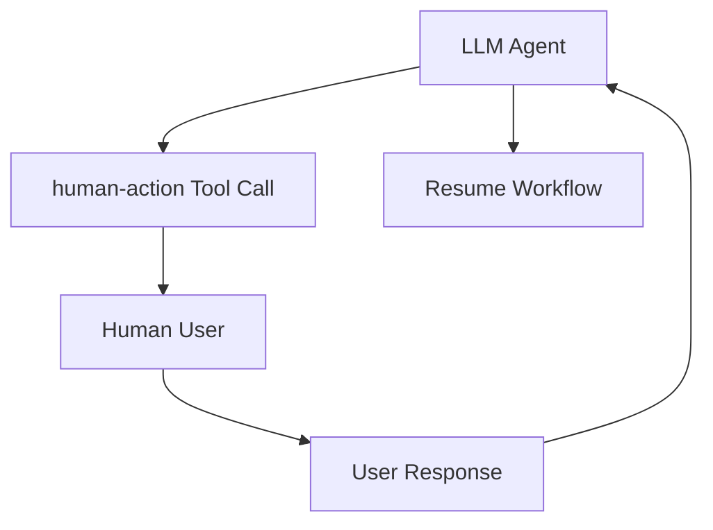
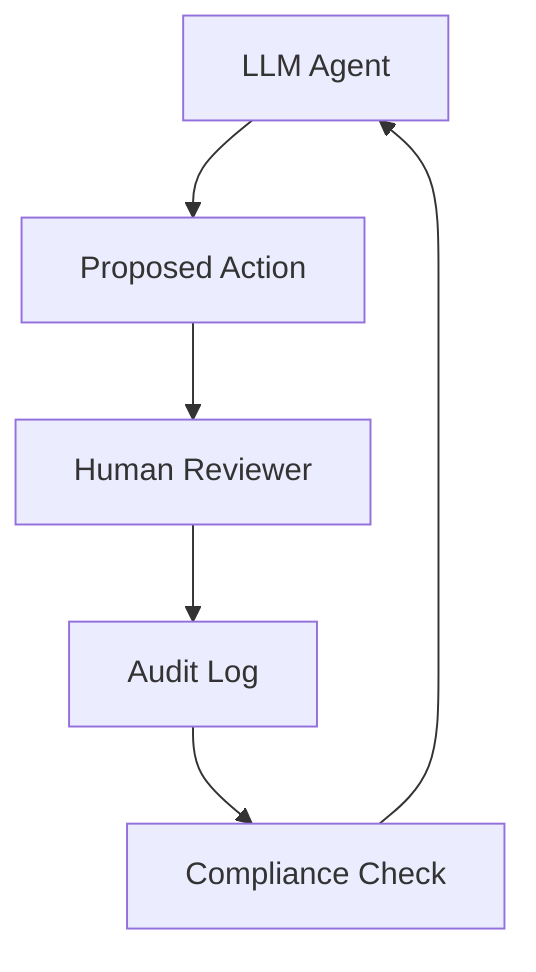
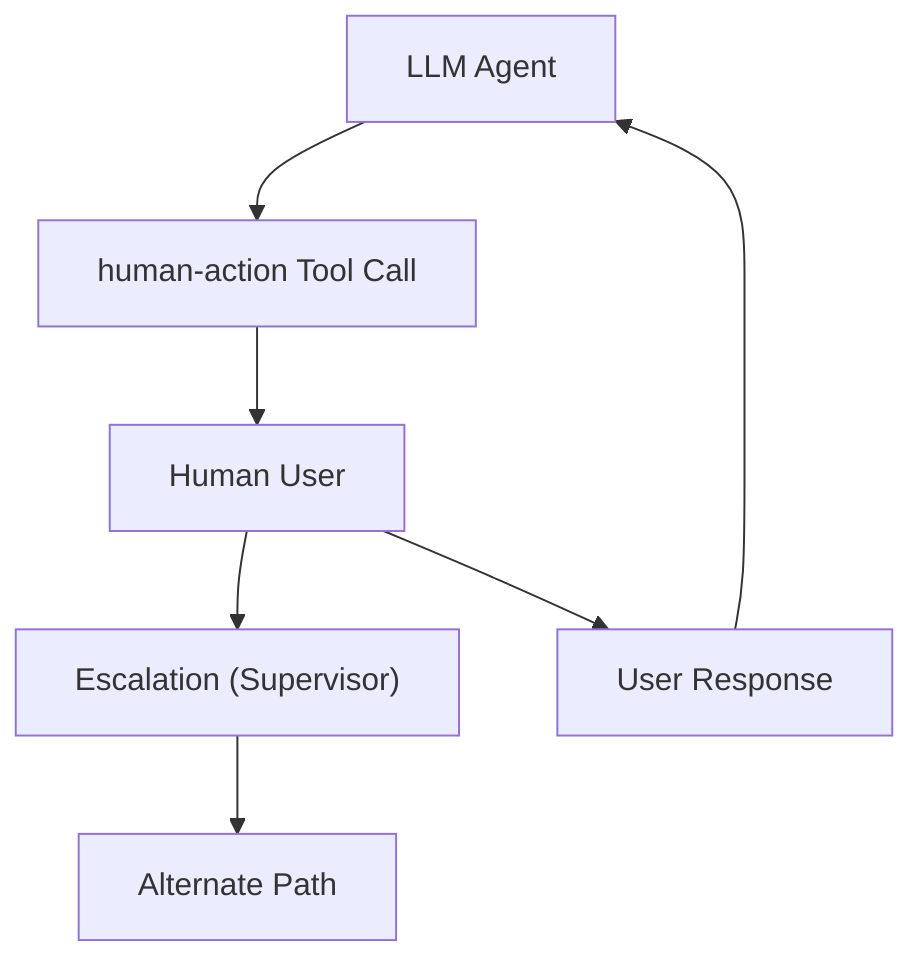
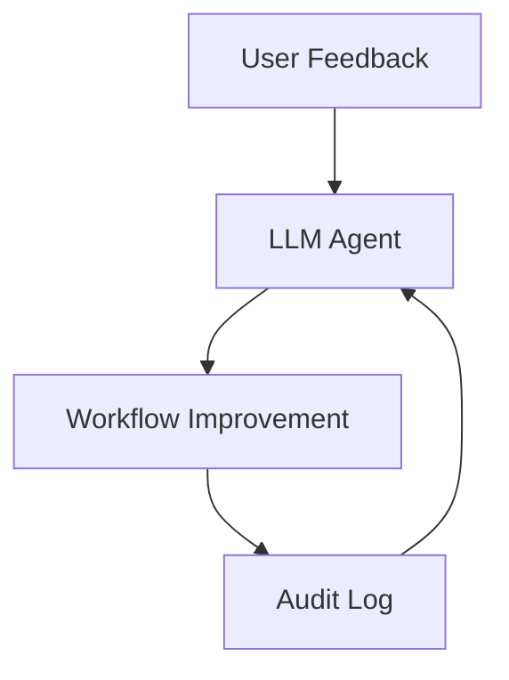
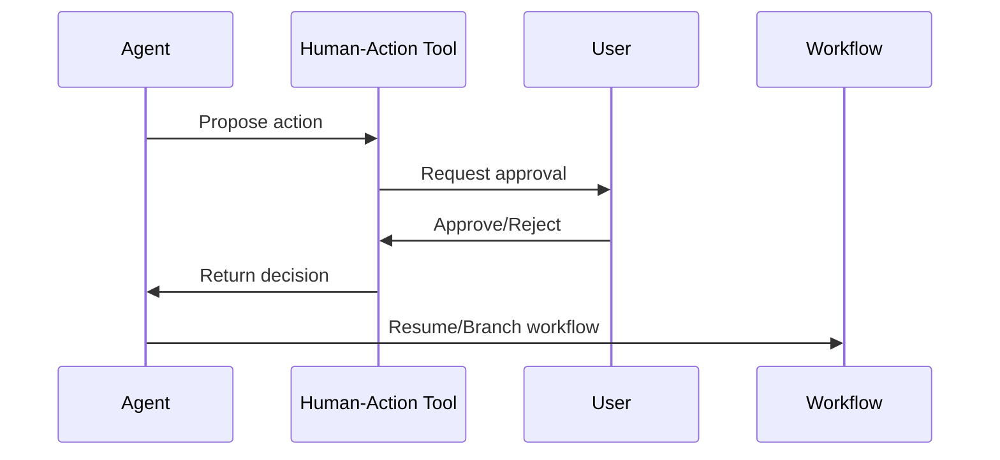
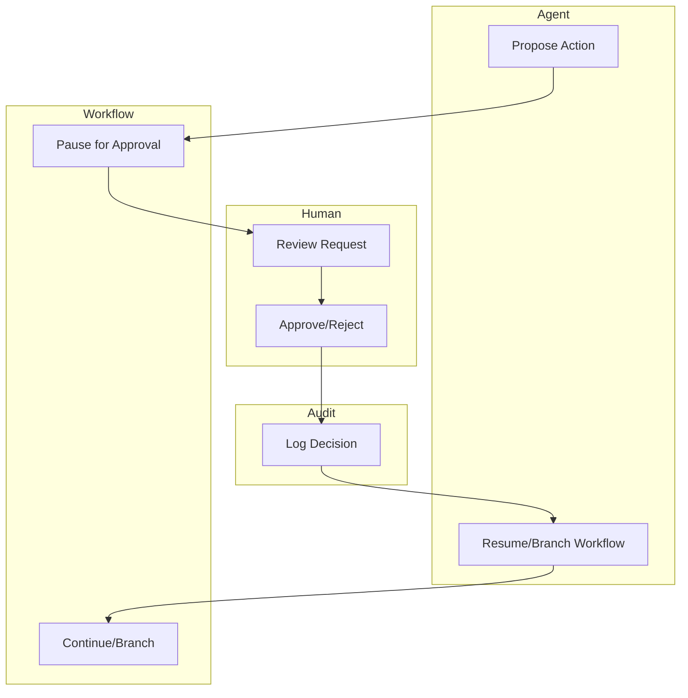

# human-action: Bridging Human and Agentic Intelligence in the MCP Ecosystem

**Keywords:** human-action, Model Context Protocol, MCP, agentic workflows, LLM, human-in-the-loop, tool invocation, prompt engineering, AI safety

---

## Introduction

As AI systems become increasingly agentic—capable of reasoning, planning, and executing complex workflows—there remains a critical need for seamless collaboration between human users and autonomous agents. The **human-action** concept within the Model Context Protocol (MCP) ecosystem addresses this need by providing a standardized mechanism for integrating human input, oversight, and intervention into automated LLM-driven processes.

---

## What is human-action in MCP?

In the context of MCP, **human-action** refers to a protocol-defined tool or action type that allows an agent (such as an LLM or workflow orchestrator) to explicitly delegate a step in its workflow to a human user. This can take many forms, including:
- Requesting human approval before executing a sensitive operation.
- Asking a user to provide missing information or resolve ambiguity.
- Inviting a human to review, edit, or augment generated content.
- Pausing an automated workflow until a human completes a required task.

By formalizing these interactions, human-action enables robust "human-in-the-loop" (HITL) workflows, which are essential for safety, compliance, and high-quality outcomes in real-world AI systems.

---

## Architecture and Protocol Design

### 1. Tool Definition in MCP
- **Tool Schema:** In MCP, tools are defined with a schema that describes their inputs, outputs, and invocation semantics. A human-action tool is typically defined with:
  - A clear description of the required human input or decision.
  - Input fields for any context or data the agent can provide.
  - Output fields for the human's response or action taken.
- **Invocation:** When an agent reaches a step requiring human input, it issues a tool call of type human-action. The MCP client (e.g., an IDE, web app, or chat interface) then presents the request to the user in a structured, actionable format.

### 2. Workflow Integration
- **Agentic Pause/Resume:** The agent's workflow is paused until the human completes the action, at which point the agent resumes with the new information or approval.
- **Auditability:** All human actions are logged as part of the workflow trace, supporting compliance and post-hoc analysis.
- **Extensibility:** The human-action pattern can be extended to support multi-step approvals, branching logic, or escalation to different user roles.

---

## Use Cases and Value Propositions

### 1. AI Safety and Oversight
- **Sensitive Operations:** Require human approval for actions with significant consequences (e.g., financial transactions, code deployment, data deletion).
- **Ethical Guardrails:** Ensure that LLMs do not make decisions outside their intended scope or expertise.

### 2. Collaborative Content Generation
- **Co-Creation:** Allow humans to review, edit, or enhance AI-generated text, code, or designs before finalization.
- **Feedback Loops:** Collect user feedback to improve prompt engineering and model performance over time.

### 3. Workflow Automation with Human-in-the-Loop
- **Exception Handling:** Route ambiguous or novel cases to human experts for resolution.
- **Progressive Automation:** Start with human-heavy workflows and gradually automate steps as confidence grows.

---

## Example: human-action Tool in an MCP Workflow

Suppose an LLM agent is orchestrating a software deployment pipeline. At the "approve deployment" step, it issues a human-action tool call:

```json
{
  "tool": "human-action",
  "description": "Approve or reject the deployment to production.",
  "inputs": {
    "change_summary": "Upgrading backend API to v2.1.0"
  },
  "outputs": {
    "approval": "pending"
  }
}
```

The MCP client presents this to the user, who can approve or reject the deployment. The agent then continues based on the user's decision, ensuring both automation and human control.

---

## Strategic Value in the MCP Ecosystem

- **Standardization:** By defining human-action as a first-class tool type, MCP enables consistent, interoperable HITL workflows across clients, servers, and agents.
- **Safety and Trust:** Human-action provides a built-in mechanism for oversight, reducing the risk of runaway automation or unintended consequences.
- **Scalability:** As organizations automate more processes, human-action allows for selective intervention, balancing efficiency with control.
- **Ecosystem Integration:** Tools like mcp-prompts, mcp-router, and mcp-project-orchestrator can all leverage human-action to create rich, collaborative workflows that combine the strengths of humans and AI agents [[5](https://github.com/sparesparrow/mcp-prompts)].

---

## Human-in-the-Loop Workflow in MCP


*Figure: The agent pauses for human input, receives a response, and resumes the workflow.*

---

## Safety and Oversight Feedback Loop


*Figure: Human oversight and audit logging ensure safety and compliance in agentic workflows.*

---

## Escalation and Branching in Human-in-the-Loop


*Figure: Human-in-the-loop workflows can escalate or branch to alternate paths based on user input.*

---

## Feedback Learning in Agentic Workflows


*Figure: User feedback is used to improve agentic workflows, with changes tracked in the audit log.*

---

## Human-in-the-Loop Approval Sequence


*Figure: Sequence of a human-in-the-loop approval process in agentic workflows.*

---

## HITL Swimlane: Responsibilities in Approval Workflow


*Figure: Swimlane diagram showing responsibilities in a human-in-the-loop approval workflow.*

---

## Conclusion

The human-action concept is a cornerstone of safe, effective, and collaborative agentic AI systems. By bridging the gap between autonomous agents and human expertise, it empowers organizations to build workflows that are not only powerful and efficient, but also transparent, auditable, and aligned with human values.

**Learn more:**
- [Model Context Protocol Introduction](https://modelcontextprotocol.io/introduction)
- [mcp-prompts GitHub](https://github.com/sparesparrow/mcp-prompts)
- [MCP Orchestration Tools](https://github.com/sparesparrow/mcp-project-orchestrator) 