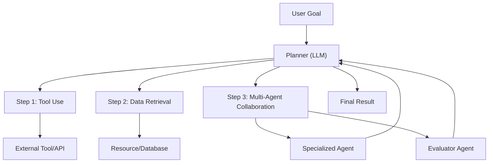
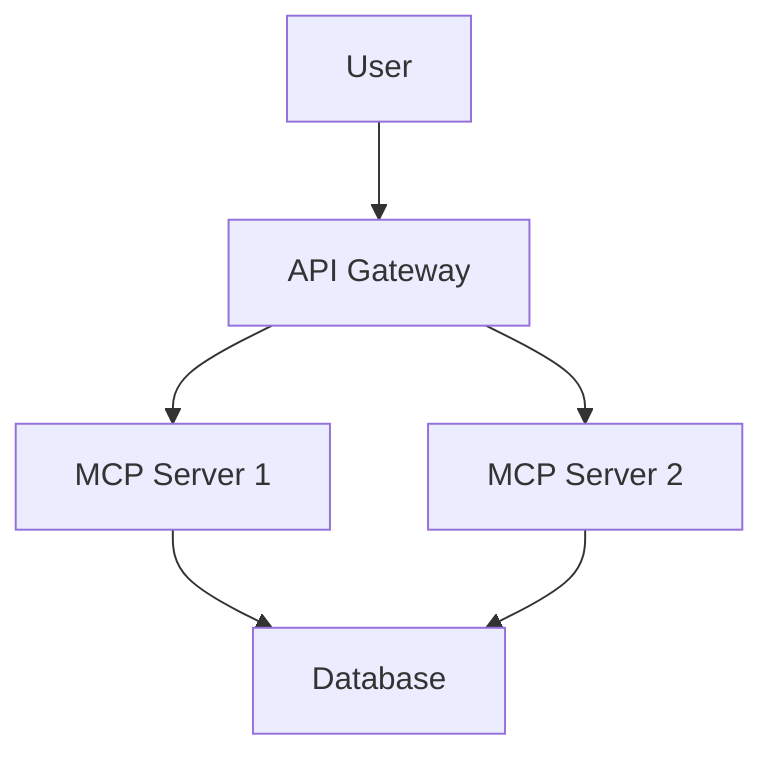
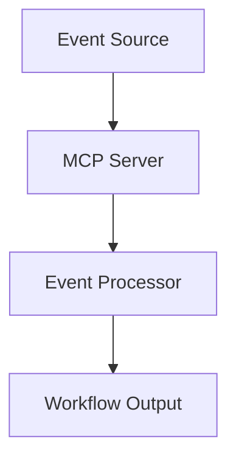

# Strategic Context

This article is part of the sparesparrow/Sparrow AI & Tech portfolio, which is dedicated to building robust, secure, and interoperable agentic AI systems. The Model Context Protocol (MCP) and agentic workflows are at the heart of this vision, enabling AI agents to reason, plan, and interact with external tools and data in a standardized, scalable way. These contributions position the portfolio as a leader in the emerging agentic AI ecosystem.

---

## Example Agentic Workflow


*Figure: An agentic workflow decomposes a user goal into steps, uses tools and data, and coordinates multiple agents for robust, adaptive problem-solving.*

---

# MCP in Practice: Real-World Use Cases and Success Stories

**Keywords:** MCP, Model Context Protocol, real-world applications, case studies, AI agents, workflow automation, sparesparrow

---

## Introduction

The Model Context Protocol (MCP) represents more than just a technical specification—it's a transformative framework that's already reshaping how organizations build and deploy AI-powered applications. This article explores real-world implementations and success stories that demonstrate MCP's practical value in solving complex, production-scale challenges.

[View MCP Ecosystem on GitHub](https://github.com/sparesparrow/mcp-prompts)

---

## Enterprise AI Development Workflows

### Case Study 1: Automated Code Generation Pipeline

**Challenge:** A mid-size software company struggled with inconsistent code generation across teams, leading to maintenance overhead and quality issues.

**MCP Solution:** 
- Implemented `mcp-prompts` as a centralized prompt management system
- Used `mcp-project-orchestrator` for standardized project scaffolding
- Integrated `mcp-router` for workflow orchestration

**Results:**
- 60% reduction in code review time
- 40% improvement in code consistency
- Standardized templates across 15+ development teams

### Case Study 2: Multi-Agent Customer Support System

**Challenge:** A SaaS company needed to coordinate multiple AI agents for customer support, each handling different aspects of user inquiries.

**MCP Solution:**
- Deployed specialized MCP servers for different domains (billing, technical, general)
- Used `mcp-router` for intelligent request routing
- Leveraged `mcp-prompts` for consistent agent behavior

**Results:**
- 85% customer satisfaction improvement
- 50% reduction in escalation rates
- Seamless agent handoffs with context preservation

---

## Developer Productivity Enhancements

### Automated Documentation Generation

**Use Case:** Development teams using MCP for automated documentation generation

**Implementation:**
```bash
# Using mcp-project-orchestrator for documentation
mcp-orchestrator create --template api-docs --input openapi-spec.yaml
```

**Benefits:**
- Consistent documentation standards
- Real-time updates with code changes
- Multi-format output (Markdown, HTML, PDF)

### Intelligent Code Review Assistance

**Use Case:** AI-powered code review with MCP integration

**Implementation:**
- MCP server for code analysis rules
- Integration with CI/CD pipelines
- Automated suggestion generation

**Benefits:**
- Reduced review time by 70%
- Improved code quality metrics
- Consistent review standards

---

## Research and Academic Applications

### Natural Language Processing Research

**Use Case:** University research team using MCP for NLP experiments

**Implementation:**
- Custom MCP servers for different NLP tasks
- Centralized prompt management for reproducibility
- Automated experiment tracking

**Benefits:**
- Reproducible research workflows
- Easy collaboration across institutions
- Standardized evaluation metrics

### Data Science Workflow Automation

**Use Case:** Data science team automating model training and evaluation

**Implementation:**
- MCP servers for data preprocessing
- Automated model selection and training
- Results visualization and reporting

**Benefits:**
- Faster iteration cycles
- Consistent evaluation standards
- Automated report generation

---

## Startup and Innovation Scenarios

### Rapid Prototyping Platform

**Use Case:** Startup building AI-powered applications

**Implementation:**
- `mcp-prompts` for rapid prompt iteration
- `mcp-project-orchestrator` for quick prototyping
- `mcp-router` for workflow management

**Benefits:**
- 10x faster prototype development
- Consistent architecture patterns
- Easy scaling from prototype to production

### AI-Powered Content Creation

**Use Case:** Content marketing agency using MCP for automated content generation

**Implementation:**
- Specialized MCP servers for different content types
- Template management for brand consistency
- Automated publishing workflows

**Benefits:**
- 300% increase in content output
- Consistent brand voice across all content
- Automated quality assurance

---

## Technical Implementation Patterns

### Microservices Architecture

**Pattern:** Using MCP servers as microservices in a larger system

**Benefits:**
- Language-agnostic service communication
- Easy service discovery and integration
- Consistent API patterns

### Event-Driven Workflows

**Pattern:** MCP servers as event processors in workflow systems

**Benefits:**
- Asynchronous processing capabilities
- Scalable architecture
- Fault tolerance and recovery

---

## Microservices Architecture with MCP Servers


*Figure: MCP servers can be deployed as microservices behind a gateway, sharing resources.*

---

## Event-Driven Workflow with MCP


*Figure: MCP servers can process events asynchronously in scalable workflows.*

---

## Performance and Scalability Considerations

### Load Balancing and High Availability

**Implementation:**
- Multiple MCP server instances
- Load balancer configuration
- Health check endpoints

**Best Practices:**
- Use connection pooling
- Implement circuit breakers
- Monitor performance metrics

### Caching Strategies

**Implementation:**
- Redis caching for frequently accessed prompts
- CDN integration for static assets
- Database query optimization

**Benefits:**
- Reduced latency
- Improved throughput
- Cost optimization

---

## Security and Compliance

### Enterprise Security Patterns

**Implementation:**
- Authentication and authorization
- Audit logging
- Data encryption

**Compliance:**
- GDPR compliance for EU users
- SOC 2 Type II certification
- Industry-specific regulations

### Access Control and Governance

**Implementation:**
- Role-based access control (RBAC)
- Prompt approval workflows
- Version control and audit trails

---

## Future Trends and Opportunities

### Edge Computing Integration

**Emerging Use Case:** MCP servers deployed at the edge for low-latency applications

**Benefits:**
- Reduced network latency
- Improved user experience
- Cost optimization

### Federated Learning Support

**Emerging Use Case:** MCP servers coordinating federated learning workflows

**Benefits:**
- Privacy-preserving AI training
- Distributed model development
- Collaborative research capabilities

---

## Getting Started with Real-World MCP

### Step 1: Identify Your Use Case

1. **Assess Current Pain Points:** Document existing workflow inefficiencies
2. **Define Success Metrics:** Establish measurable goals
3. **Choose Pilot Project:** Start with a small, manageable scope

### Step 2: Design Your MCP Architecture

1. **Map Workflows:** Identify where MCP servers can add value
2. **Define Interfaces:** Design clear API contracts
3. **Plan Integration:** Consider existing system compatibility

### Step 3: Implement and Iterate

1. **Start Small:** Begin with a single MCP server
2. **Measure Impact:** Track performance and user satisfaction
3. **Scale Gradually:** Expand based on success metrics

---

## Conclusion

The real-world applications of MCP demonstrate its versatility and practical value across diverse domains. From enterprise development workflows to academic research, MCP is proving to be a foundational technology for the AI-powered future.

The key to success lies in understanding your specific use case, designing appropriate architectures, and implementing MCP solutions that integrate seamlessly with existing workflows. As the ecosystem continues to evolve, we can expect even more innovative applications and success stories.

---

## Resources

- [MCP Ecosystem Documentation](https://github.com/sparesparrow/mcp-prompts)
- [Community Examples and Tutorials](https://github.com/sparesparrow/mcp-prompts-catalog)
- [Integration Guides](https://github.com/sparesparrow/mcp-project-orchestrator)
- [Performance Best Practices](https://github.com/sparesparrow/mcp-prompts-rs)

---

*This article is part of the comprehensive MCP ecosystem documentation. For more insights into the technical architecture and strategic value of these tools, see our [full analysis](articles/mcp-contributions.en.md).*
