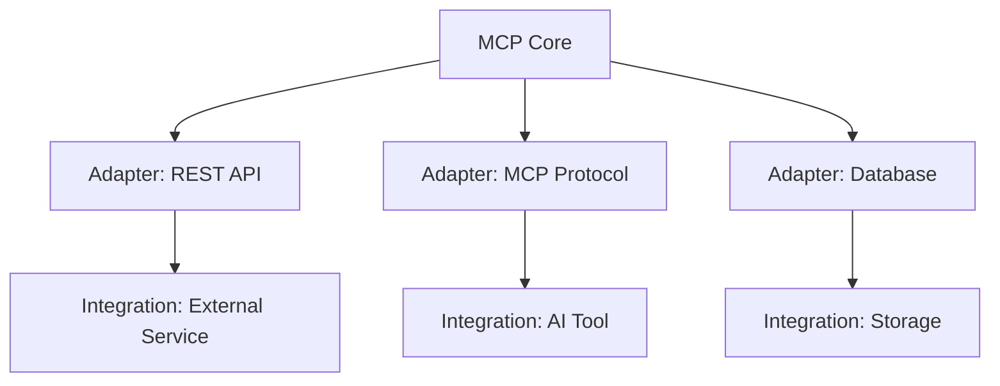
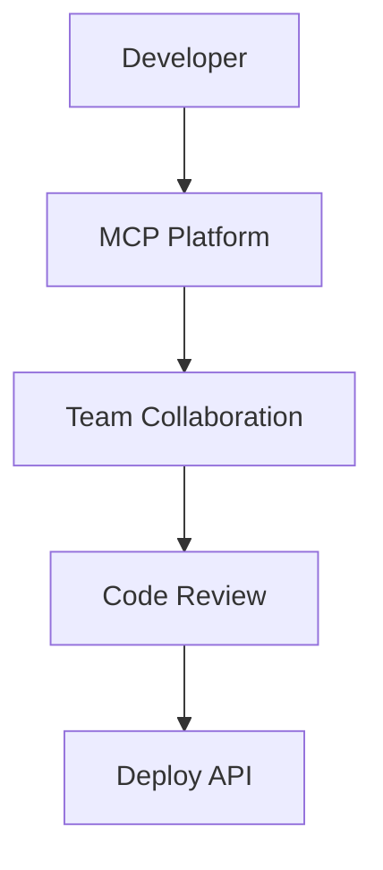

# MCP: The Open-Source API Platform for Modern AI Workflows

**Keywords:** MCP, sparrow-api, open source, API management, AI, extensibility, collaboration, Model Context Protocol

---

## What is MCP?

The Model Context Protocol (MCP), also known as sparrow-api, is an open-source platform designed to empower developers and teams to build, test, and manage modern AI workflows and APIs with ease. MCP stands out as a flexible, extensible, and collaborative solution for API development, making it a go-to tool for anyone working in the AI and software engineering space.

[View the MCP / sparrow-api repository on GitHub](https://github.com/sparrowapp-dev/sparrow-api)

---

## Key Features

- **Unified API Management:** MCP provides a one-stop solution for creating, testing, and distributing APIs, streamlining the development process for AI-powered applications.
- **Extensibility:** Thanks to its modular, hexagonal architecture, MCP allows developers to add new integrations, adapters, and features without disrupting the core system.
- **Collaboration:** Built with teams in mind, MCP supports collaborative workflows, making it easy to share, review, and improve API logic together.
- **Open Source:** Licensed under AGPL-3.0, MCP encourages community contributions and transparency, ensuring the platform evolves with the needs of its users.

---

## Technical Highlights

- **Modern Tech Stack:** MCP leverages TypeScript, NestJS, Mongoose, Rust, Tauri, Svelte, and Vite, providing a robust and scalable foundation for API development.
- **Hexagonal Architecture:** By adopting the Ports and Adapters pattern, MCP separates core business logic from infrastructure, making it easy to swap out storage engines, authentication methods, or templating systems. [Learn more about hexagonal architecture in MCP](hexagonal-architecture-in-mcp.md)
- **Integration Ready:** Whether you need to connect to databases, third-party AI services, or custom frontends, MCP's adapter system makes integration straightforward.
- **Developer Experience:** Features like built-in Swagger documentation, Docker support, and a default user for quick onboarding make MCP accessible to both beginners and experts.

---

## Community & Impact

MCP is more than just a codebase—it's a growing community of developers passionate about building better AI tools. With dozens of contributors and a focus on open collaboration, MCP is rapidly becoming a standard for API management in AI projects.

- **Contributions Welcome:** The project thrives on community input. Whether you're fixing bugs, adding features, or improving documentation, your contributions are valued.
- **Adoption:** MCP is used by teams and individuals worldwide to accelerate AI development and foster innovation.
- **Vision:** The goal is to create a future-proof, adaptable platform that keeps pace with the evolving AI landscape.

---

## Modular Architecture of MCP


*Figure: MCP's modular architecture enables flexible integrations and extensibility.*

---

## Collaborative API Development Workflow


*Figure: MCP supports collaborative, review-driven API development and deployment.*

---

## Getting Started

1. **Clone the Repository:**
   ```bash
   git clone https://github.com/sparrowapp-dev/sparrow-api.git
   cd sparrow-api
   ```
2. **Install Dependencies:**
   - With Docker: `pnpm docker:up`
   - Without Docker: `pnpm i && pnpm start:dev`
3. **Access the API Docs:**
   - Visit `http://localhost:{PORT}/api/docs` for interactive Swagger documentation.
4. **Default Login:**
   - Email: `dev@sparrow.com`
   - Password: `12345678@`
5. **Contribute:**
   - Fork the repo, create a branch, and submit a pull request!

---

## Conclusion

MCP (sparrow-api) is redefining how developers approach API management in the age of AI. Its open-source nature, extensible design, and vibrant community make it an essential tool for anyone building intelligent, scalable, and maintainable software.

**Ready to join the community? [Get started with MCP today!](https://github.com/sparrowapp-dev/sparrow-api)** 