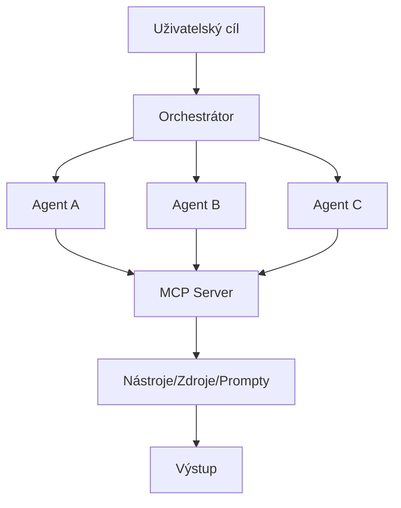
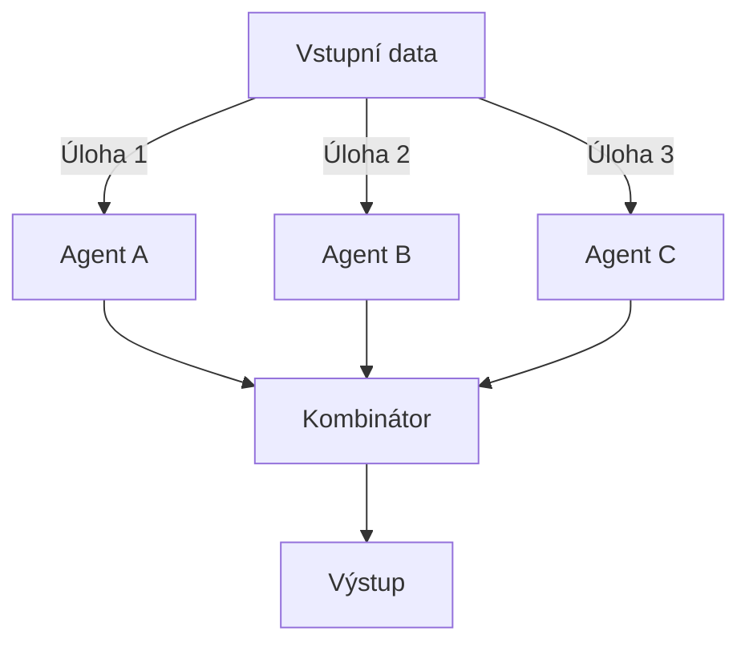
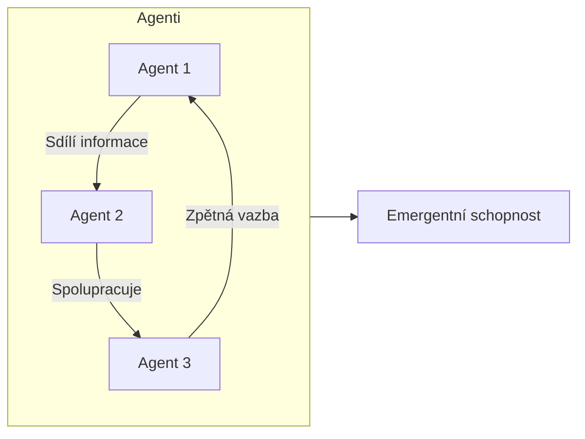
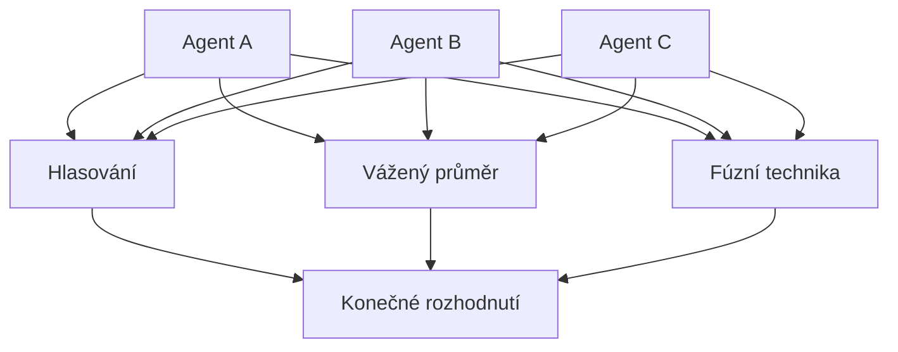
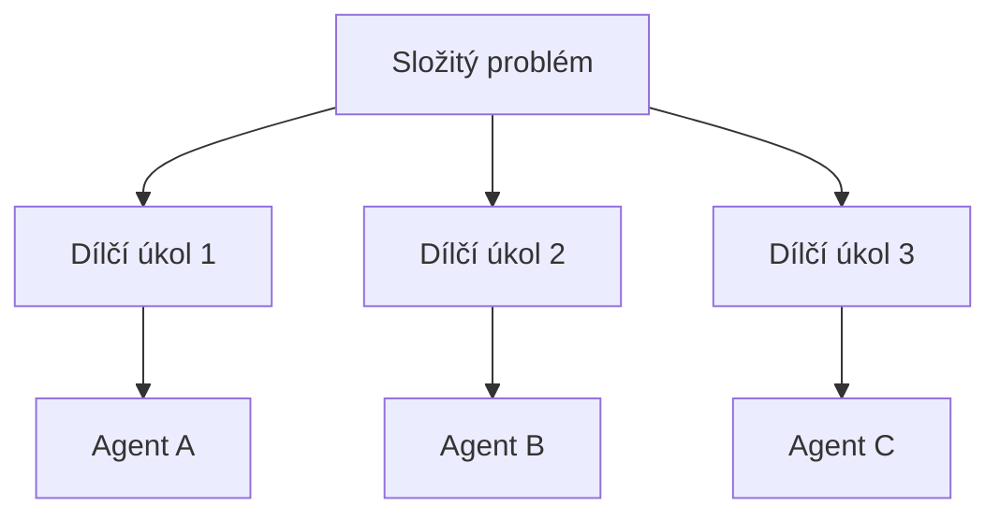

# Význam pro portfolio

Tento článek je součástí portfolia sparesparrow/Sparrow AI & Tech, které se zaměřuje na budování robustních, bezpečných a interoperabilních agentních AI systémů. Přístup směsi agentů je klíčovým architektonickým vzorem portfolia, umožňujícím komplexní, adaptivní a odolné workflow díky kombinaci specializovaných agentů, orchestrátorů a Model Context Protocolu (MCP). Tato práce dokládá schopnost navrhovat škálovatelné multi-agentní AI ekosystémy.

---

## Směs agentů v agentním MCP ekosystému

*Obrázek: Směs agentů, koordinovaná orchestrátorem a propojená přes MCP, umožňuje robustní, adaptivní AI řešení.*

---

Směs agentů (Mixture of Agents) označuje přístup v umělé inteligenci a strojovém učení, kdy je kombinováno více AI agentů nebo modelů k řešení složitých úloh nebo rozhodování. Tento přístup využívá silné stránky různých agentů, aby bylo možné dosáhnout lepšího celkového výkonu, než by zvládl kterýkoli jednotlivý agent samostatně.

Klíčové aspekty přístupu Směsi agentů:

1. Různorodí agenti: Systém využívá více AI agentů, z nichž každý může být specializovaný na různé dílčí úlohy nebo mít odlišné schopnosti.

2. Strategie kombinace: Existují různé metody, jak kombinovat výstupy nebo rozhodnutí jednotlivých agentů, například hlasování, vážený průměr nebo složitější fúzní techniky.

3. Rozklad úlohy: Složitý problém může být rozdělen na dílčí úlohy, přičemž různí agenti řeší konkrétní části celkového úkolu.

4. Adaptabilita: Systém může potenciálně přizpůsobovat, které agenty použije nebo jak jejich výstupy kombinuje na základě konkrétního vstupu nebo kontextu.

5. Zvýšená robustnost: Díky spoléhání na více agentů může být systém odolnější vůči selhání nebo zaujatosti jednotlivých agentů.

6. Potenciál pro emergentní chování: Interakce mezi různými agenty může někdy vést ke vzniku schopností, které přesahují možnosti kteréhokoli jednotlivého agenta.

---

**Příklad: Jednoduchá architektura směsi agentů**

*Obrázek: Více specializovaných agentů zpracovává vstup a jejich výstupy jsou kombinovány pro finální rozhodnutí.*

---

**Příklad: Emergentní chování při interakci agentů**

*Obrázek: Interakce mezi agenty může vést ke vzniku nových schopností, které žádný jednotlivý agent nemá.*

---

Tento přístup se využívá v různých AI aplikacích, včetně zpracování přirozeného jazyka, počítačového vidění, robotiky a rozhodovacích systémů. V některých ohledech je podobný ansámblovým metodám ve strojovém učení, ale často zahrnuje složitější interakce mezi agenty.

Chcete, abych podrobněji rozvedl některý konkrétní aspekt přístupu Směsi agentů? 

---

## Strategie spolupráce agentů

*Obrázek: Agenti mohou spolupracovat pomocí hlasování, váženého průměru nebo fúzních technik k dosažení rozhodnutí.*

---

## Rozklad úlohy a přiřazení agentům

*Obrázek: Složitý problém je rozdělen na dílčí úkoly, které jsou přiřazeny specializovaným agentům.* 