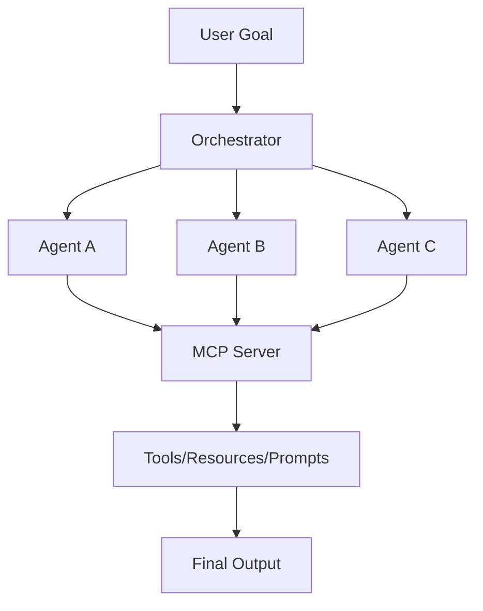
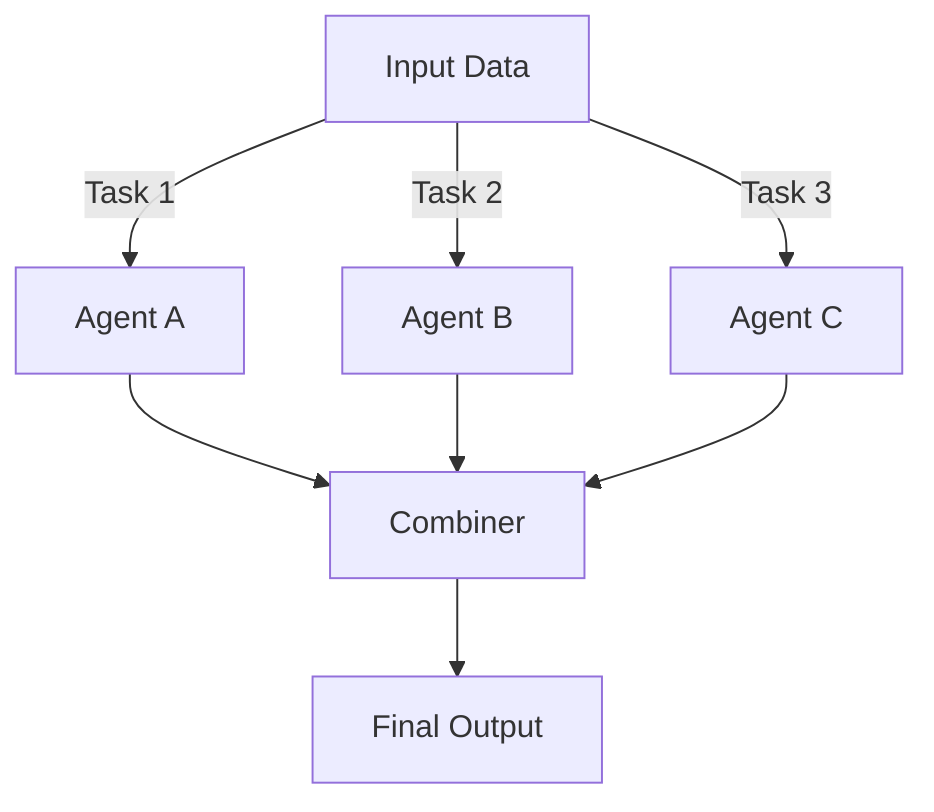
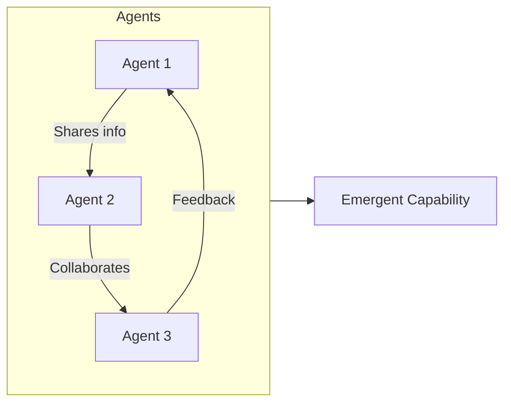
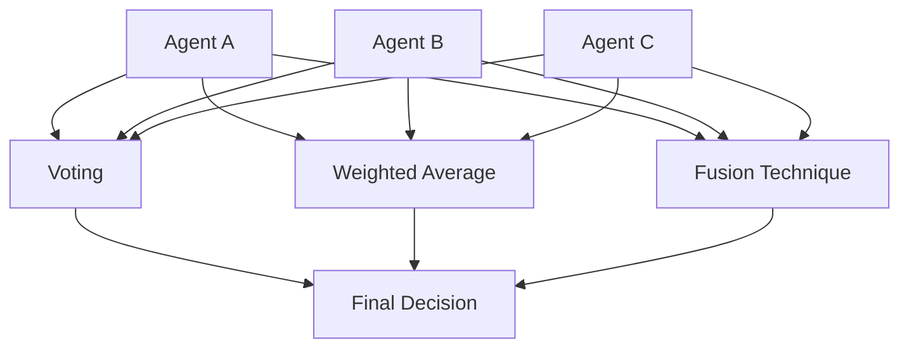
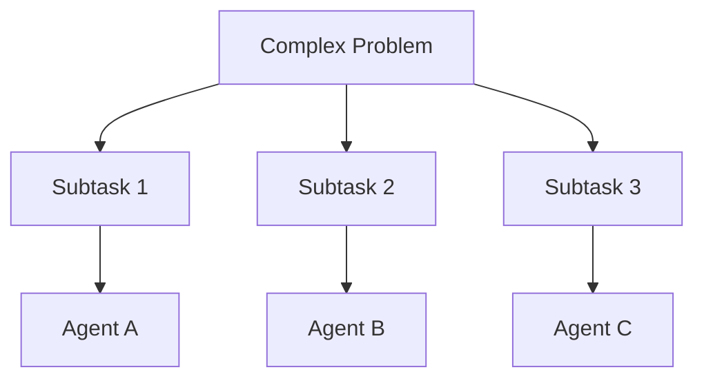

# Portfolio Relevance

This article is part of the sparesparrow/Sparrow AI & Tech portfolio, which is dedicated to building robust, secure, and interoperable agentic AI systems. The mixture of agents approach is a key architectural pattern in the portfolio, enabling complex, adaptive, and resilient workflows by combining specialized agents, orchestrators, and the Model Context Protocol (MCP). This work demonstrates leadership in designing scalable, multi-agent AI ecosystems.

---

## Mixture of Agents in the Agentic MCP Ecosystem

*Figure: A mixture of agents, coordinated by an orchestrator and connected via MCP, enables robust, adaptive AI solutions.*

---

Mixture of Agents refers to an approach in artificial intelligence and machine learning where multiple AI agents or models are combined to solve complex tasks or make decisions. This approach leverages the strengths of different agents to potentially achieve better overall performance than any single agent could on its own.

Key aspects of Mixture of Agents include:

1. Diverse agents: The system utilizes multiple AI agents, each potentially specialized for different subtasks or having different capabilities.

2. Combination strategies: Various methods can be used to combine the outputs or decisions of individual agents, such as voting, weighted averaging, or more complex fusion techniques.

3. Task decomposition: Complex problems may be broken down into subtasks, with different agents handling specific parts of the overall task.

4. Adaptability: The system can potentially adapt which agents are used or how their outputs are combined based on the specific input or context.

5. Improved robustness: By relying on multiple agents, the system may be more robust to individual agent failures or biases.

6. Potential for emergent behavior: The interaction between different agents can sometimes lead to emergent capabilities that surpass what any individual agent can do.

---

**Example: Simple Mixture of Agents Architecture**

*Figure: Multiple specialized agents process input and their outputs are combined for a final decision.*

---

**Example: Emergent Behavior in Agent Interaction**

*Figure: Interactions between agents can lead to new, emergent capabilities not present in any single agent.*

---

## Agent Collaboration Strategies

*Figure: Agents can collaborate using voting, weighted averaging, or fusion techniques to reach a decision.*

---

## Task Decomposition and Assignment

*Figure: A complex problem is decomposed into subtasks, each assigned to a specialized agent.*

This approach is used in various AI applications, including natural language processing, computer vision, robotics, and decision-making systems. It's similar in some ways to ensemble methods in machine learning, but often involves more complex interactions between agents.

Would you like me to elaborate on any specific aspect of Mixture of Agents?