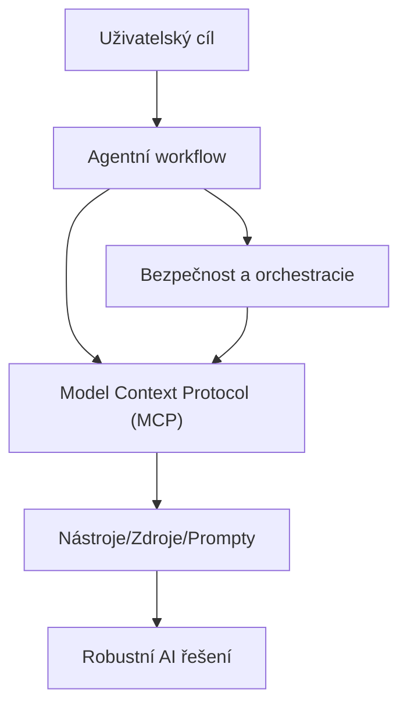
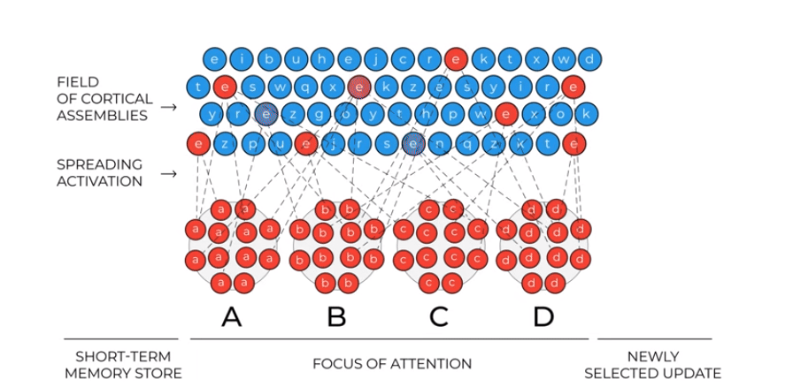
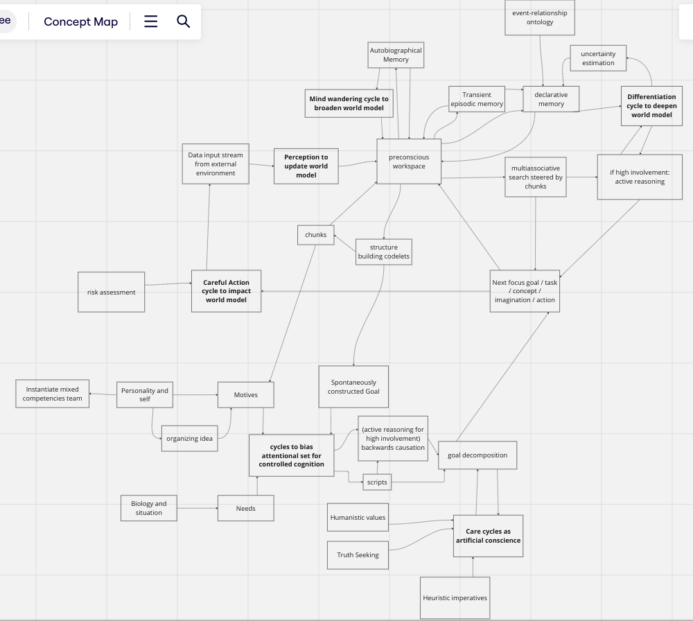

# Význam pro portfolio

Tento článek je součástí portfolia sparesparrow/Sparrow AI & Tech, které se zaměřuje na rozvoj teorie i praxe agentních AI systémů. Popsané kognitivní architektury a koncepty aktivního uvažování přímo ovlivňují návrh bezpečných, interoperabilních a škálovatelných agentních workflow, jak jsou implementovány v MCP ekosystému a souvisejících projektech. Tato práce dokládá schopnost propojit teorii s praxí pro AI systémy nové generace.

---

## Agentní workflow, MCP a bezpečná orchestracie

*Obrázek: Agentní workflow využívá MCP a bezpečnou orchestraci k dosažení robustních, adaptivních AI řešení.*

---

# Směrem k aktivně uvažujícím LLM systémům

*Autor: Knut Jägersberg, adaptováno a shrnuto pro sparrow-ai-tech*

---

## Úvod

Tento článek zkoumá průsečík foundation modelů, kognitivních architektur a složených systémů s cílem dosáhnout formy umělé obecné inteligence (AGI) nebo „umělé lidské inteligence“. Zabýváme se:
- Požadavky na myslící stroj
- Kognitivní architekturou založenou na LLM
- Aktivním uvažováním

---

## Teorie iterativní aktualizace pracovní paměti (Reser, 2023)

Vývoj dalšího zaměření pozornosti lze chápat jako hledání podobnosti v asociacích v dlouhodobé paměti. Pracovní paměť funguje jako sofistikovaný doporučovací systém obsahu, operující na kontinuu mezi systémem 1 a systémem 2, přičemž systém 2 vzniká ze systému 1.

---

## Co je to myšlení?

Myšlení je produktem mentální aktivity, zahrnuje vnímání, paměť, rozhodování, úsudek a akci. Uvažování není omezeno pouze na logiku; zahrnuje také vnímání a představivost. Logické uvažování vzniká konvergencí k novým abstrakcím, podpořeným kvalitními znalostmi o světě.

---

## LIDA-inspirovaná smíšená kognitivní architektura

Teorie LIDA popisuje kognici jako opakující se cyklus vnímání, porozumění a akce. Mysl funguje tak, že doporučuje, na co myslet dál, přičemž zaměření pozornosti je samoorganizující.

---

## Pracovní definice inteligence

- **Inteligence**: Schopnost volit mezi různými možnostmi a přizpůsobovat se prostředí s nedostatečnými znalostmi a zdroji (Wang, 2019).
- **Obecná inteligence**: Složité, samoorganizující se systémy, které rozpoznávají a vytvářejí vzory v sobě a ve svém okolí (Goertzel, 2021).

---

## Model kaskády řízení exekutivních funkcí (Banich, 2009)

Směrování pozornosti je dosaženo emergentním a strategickým ovlivňováním aktivace pro formulaci a řešení problémů. Položky v krátkodobé pracovní paměti ovlivňují další zaměření pozornosti, které je získáváno z dlouhodobé paměti.

---

## Aktivní uvažování

Aktivní uvažování zajišťuje, že výstupy odpovídají kritériím znalostí o světě. Zahrnuje:
- Propoziční uvažování prostřednictvím řetězců transformací
- Samoorganizované vyhledávání a asociaci faktů a šablon
- Diferenciaci: využití existujících znalostí k zařazení nových kombinací do těla znalostí

---

## Příklad: Učení se rozlišovat záměrně

Proces zahrnuje:
1. Sebe-naraci a bloudění mysli
2. Formování cílů a motivů
3. Rozklad cílů logickou inferencí
4. Iterativní provádění a úpravy

Cykly péče jsou integrovány pro etické sladění, což zajišťuje, že systém nejprve uvažuje o etických důsledcích.

---

## Reference

- Banich (2009). Executive Function: The Search for an Integrated Account. [Odkaz](https://sci-hub.yncjkj.com/10.1111/j.1467-8721.2009.01615.x)
- Bottou (2011). From Machine Learning to Machine Reasoning. [arXiv](https://arxiv.org/abs/1102.1808)
- Goertzel (2021). The General Theory of General Intelligence. [arXiv](https://arxiv.org/abs/2103.15100)
- Houdé a Borst (2015). Teorie inhibiční kontroly mozku při uvažování. [Frontiers](https://www.frontiersin.org/articles/10.3389/fnhum.2015.00148/full)
- John et al (2022). Propojení dynamických systémů s neurozobrazováním člověka. [ResearchGate](https://www.researchgate.net/publication/357783628_It's_about_time_Linking_dynamical_systems_with_human_neuroimaging_to_understand_the_brain)
- Kugele & Franklin (2020). Learning in LIDA. [ResearchGate](https://www.researchgate.net/publication/347080823_Learning_in_LIDA)
- Legg & Hutter (2007). Sběr definic inteligence. [arXiv](https://arxiv.org/abs/0706.3639)
- Naumenko (2023). Teorie jazyka jako odrazu modelování světa lidskou inteligencí. [LingBuzz](https://ling.auf.net/lingbuzz/007345)
- Reser (2023). Model iterativní aktualizace pracovní paměti. [YouTube](https://www.youtube.com/watch?v=R2H2Pl0I6EA)
- Suereth (2024). Péče jako ochrana v umělé inteligenci. [ScienceDirect](https://www.sciencedirect.com/science/article/pii/S2664329424000025)
- Teig a Scherer (2016). Formální a neformální uvažování. [NCBI](https://www.ncbi.nlm.nih.gov/pmc/articles/PMC4949208/)
- Wang (2019). O definici umělé inteligence. [Sciendo](https://sciendo.com/article/10.2478/jagi-2019-0002)

---

*Pro diagramy a další čtení viz původní článek na [Hugging Face](https://huggingface.co/blog/KnutJaegersberg/active-reasoning).* 