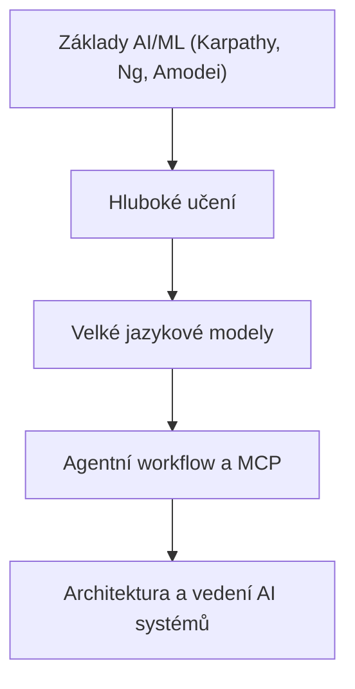
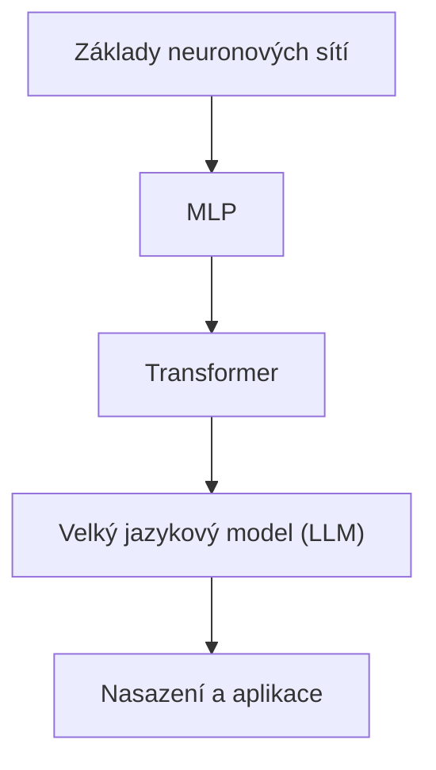
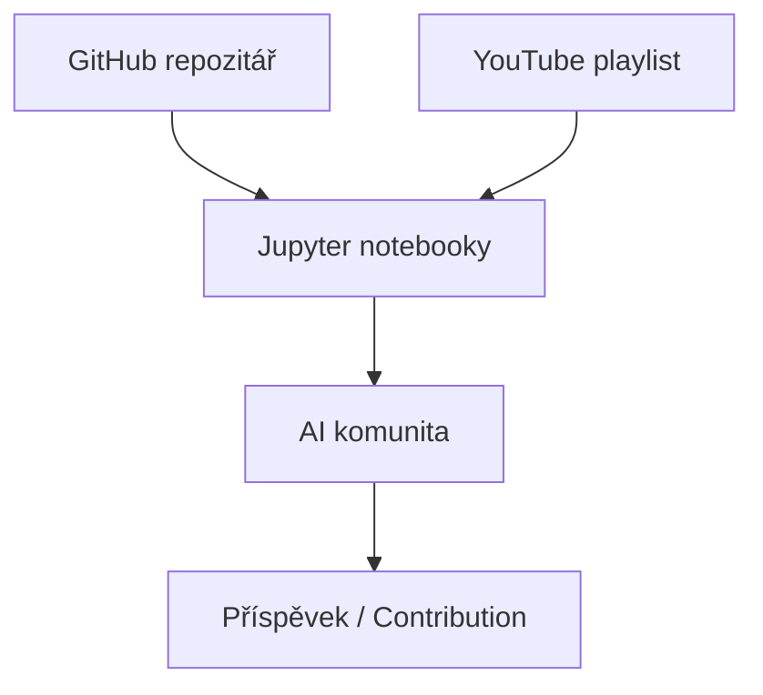

# Portfolio Relevance

This article is part of the sparesparrow/Sparrow AI & Tech portfolio, which is dedicated to building robust, secure, and interoperable agentic AI systems. Mastering foundational AI/ML concepts, as taught in Karpathy's courses, is essential for developing, understanding, and leading the next generation of agentic workflows, MCP-based architectures, and secure AI ecosystems. These skills form the base of the technical skill tree for AI leadership.

---

## Skill Tree: From Foundations to Agentic AI

_Figure: Foundational AI/ML education is the root of the skill tree leading to agentic AI system leadership._

---

# Andrej Karpathy: Nejlepší online kurzy a workshopy pro neuronové sítě a AI

**Klíčová slova:** Andrej Karpathy, Zero to Hero, LLM101n, neuronové sítě, umělá inteligence, online kurz, strojové učení, čeština

---

## Úvod

Andrej Karpathy je jednou z nejvýraznějších osobností v oblasti umělé inteligence a hlubokého učení. Jeho online kurzy a workshopy, zejména série **Neural Networks: Zero to Hero** a **LLM101n**, patří mezi nejdostupnější a nejpraktičtější zdroje pro každého, kdo se chce naučit základy i pokročilé techniky neuronových sítí a jazykových modelů. Tento článek představuje tyto kurzy českému publiku a vysvětluje, proč by je měl každý zájemce o AI znát.

---

## Neural Networks: Zero to Hero

- **GitHub repozitář:** [karpathy/nn-zero-to-hero](https://github.com/karpathy/nn-zero-to-hero)
- **YouTube playlist:** [Zero to Hero na YouTube](https://www.youtube.com/playlist?list=PLAqhIrjkxbuWI23v9cThsA9GvCAUhRvKZ)

### Co kurz nabízí?

Tato série videí a Jupyter notebooků vás provede od úplných základů neuronových sítí až po stavbu vlastního GPT modelu. Karpathy vysvětluje vše krok za krokem, včetně:

- Základů zpětné propagace (backpropagation)
- Stavby jednoduchých i složitějších jazykových modelů (bigram, MLP, Transformer)
- Praktických cvičení v Pythonu a PyTorch
- Diagnostiky a ladění hlubokých sítí
- Implementace vlastního tokenizéru pro LLM

### Pro koho je kurz určen?

- Pro začátečníky i pokročilé, kteří chtějí pochopit principy neuronových sítí "od nuly".
- Pro vývojáře, kteří chtějí stavět vlastní AI modely a rozumět jim do hloubky.
- Pro studenty, kteří hledají praktické návody a cvičení.

### Proč je kurz výjimečný?

- **Praktický přístup:** Každý koncept je vysvětlen na konkrétním kódu.
- **Otevřenost:** Všechny materiály jsou zdarma a open-source (MIT licence).
- **Komunita:** Kurz má tisíce hvězdiček na GitHubu a aktivní komunitu.

---

## LLM101n: Stavba vlastního jazykového modelu

- **GitHub repozitář:** [karpathy/LLM101n](https://github.com/karpathy/LLM101n)

### O čem je LLM101n?

Tento kurz je zaměřen na stavbu vlastního velkého jazykového modelu (LLM) od základů až po funkční webovou aplikaci podobnou ChatGPT. Obsahuje kapitoly o:

- Jazykovém modelování (bigram, n-gram, Transformer)
- Základech strojového učení a optimalizace
- Tokenizaci a byte pair encodingu (BPE)
- Trénování a ladění modelů na CPU i GPU
- Nasazení modelu jako API nebo webové aplikace

### Proč je LLM101n důležitý?

- **Kompletní průvodce:** Od teorie až po praktickou implementaci v Pythonu, C a CUDA.
- **Moderní témata:** Pokrývá i pokročilé techniky jako kvantizace, finetuning, multimodální modely.
- **Inspirace:** Kurz je veden heslem "Co nedokážu vytvořit, tomu nerozumím" (Richard Feynman).

---

## Progrese: Od základních neuronových sítí k LLM

_Obrázek: Progrese od základních neuronových sítí přes MLP a Transformer až k LLM a jejich nasazení._

---

## Open-source workflow učení

_Obrázek: Otevřený workflow učení zahrnuje GitHub, YouTube, notebooky, komunitu a příspěvky._

---

## Jak začít?

1. **Navštivte GitHub repozitáře** ([nn-zero-to-hero](https://github.com/karpathy/nn-zero-to-hero), [LLM101n](https://github.com/karpathy/LLM101n)) a stáhněte si notebooky.
2. **Sledujte videa na YouTube** – playlisty jsou veřejné a zdarma.
3. **Vyzkoušejte si cvičení** – každý díl obsahuje praktické úkoly.
4. **Zapojte se do komunity** – sdílejte své poznatky, ptejte se na GitHubu nebo v diskuzích.

---

## Závěr

Kurzy Andreje Karpathyho jsou jedinečnou příležitostí pro českou AI komunitu naučit se nejmodernější techniky neuronových sítí a jazykových modelů přímo od světové špičky. Doporučujeme je všem, kdo chtějí rozumět AI nejen teoreticky, ale i prakticky.

---

**Odkazy:**

- [Neural Networks: Zero to Hero (GitHub)](https://github.com/karpathy/nn-zero-to-hero)
- [Zero to Hero – YouTube playlist](https://www.youtube.com/playlist?list=PLAqhIrjkxbuWI23v9cThsA9GvCAUhRvKZ)
- [LLM101n (GitHub)](https://github.com/karpathy/LLM101n)

---

_Článek připraven pro šíření znalostí v české AI komunitě. Sdílejte a inspirujte další!_
