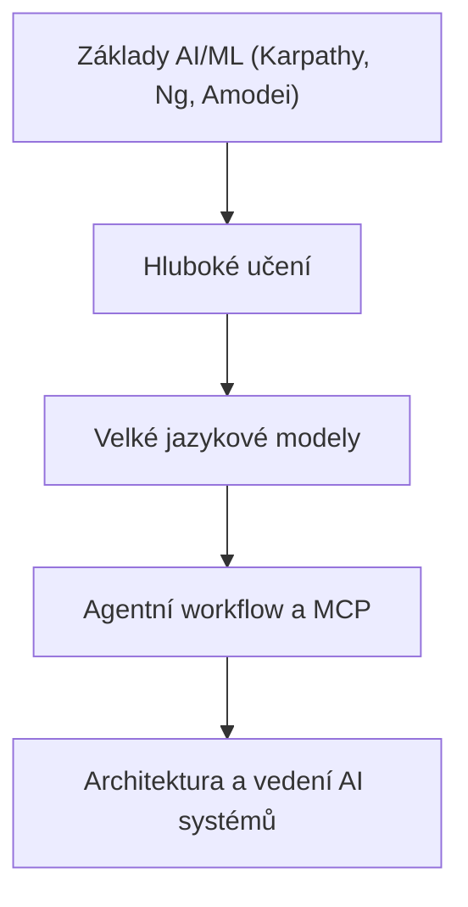
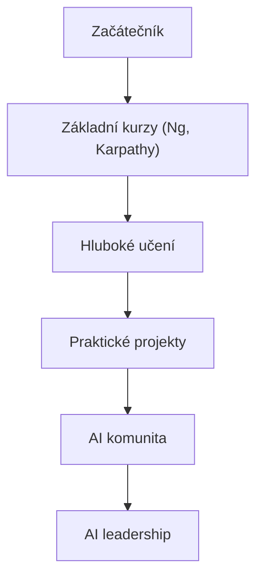
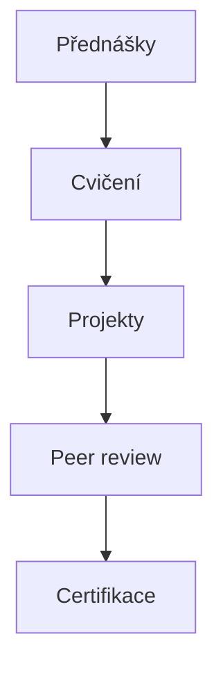

# Portfolio Relevance

This article is part of the sparesparrow/Sparrow AI & Tech portfolio, which is dedicated to building robust, secure, and interoperable agentic AI systems. Mastering foundational AI/ML concepts, as taught in Andrew Ng's courses, is essential for developing, understanding, and leading the next generation of agentic workflows, MCP-based architectures, and secure AI ecosystems. These skills form the base of the technical skill tree for AI leadership.

---

## Skill Tree: From Foundations to Agentic AI

_Figure: Foundational AI/ML education is the root of the skill tree leading to agentic AI system leadership._

---

# Andrew Ng: Nejlepší online kurzy a workshopy pro strojové učení a AI

**Klíčová slova:** Andrew Ng, strojové učení, umělá inteligence, Coursera, DeepLearning.AI, Machine Learning, čeština

---

## Úvod

Andrew Ng je jednou z nejvýznamnějších osobností v oblasti strojového učení a umělé inteligence. Jeho online kurzy a workshopy, zejména na platformách Coursera a DeepLearning.AI, pomohly milionům lidí po celém světě pochopit základy i pokročilé techniky AI. Tento článek představuje jeho nejdůležitější kurzy českému publiku a vysvětluje, proč by je měl každý zájemce o AI znát.

---

## Machine Learning (Coursera)

- **Odkaz na kurz:** [Machine Learning by Andrew Ng (Coursera)](https://www.coursera.org/learn/machine-learning)

### Co kurz nabízí?

Tento legendární kurz je považován za vstupní bránu do světa strojového učení. Andrew Ng zde srozumitelně vysvětluje:

- Základy učení s učitelem i bez učitele
- Regresi, klasifikaci, neuronové sítě, SVM, k-means a další algoritmy
- Praktické implementace v Octave/MATLAB (vhodné i pro začátečníky)
- Tipy na ladění modelů a vyhodnocování výsledků

### Pro koho je kurz určen?

- Pro úplné začátečníky v AI a datové vědě
- Pro studenty i profesionály, kteří chtějí pochopit principy strojového učení
- Pro každého, kdo chce začít kariéru v AI

### Proč je kurz výjimečný?

- **Srozumitelnost:** Andrew Ng je známý svým jasným a trpělivým výkladem.
- **Praktické zaměření:** Kurz obsahuje mnoho cvičení a reálných příkladů.
- **Komunita:** Absolvovalo jej přes 5 milionů lidí po celém světě.

---

## Deep Learning Specialization (Coursera, DeepLearning.AI)

- **Odkaz na kurz:** [Deep Learning Specialization (Coursera)](https://www.coursera.org/specializations/deep-learning)

### Co specializace nabízí?

Tato série pěti kurzů vás provede moderním hlubokým učením:

1. **Neural Networks and Deep Learning**
2. **Improving Deep Neural Networks**
3. **Structuring Machine Learning Projects**
4. **Convolutional Neural Networks**
5. **Sequence Models**

### Proč absolvovat tuto specializaci?

- Naučíte se stavět a trénovat hluboké neuronové sítě v Pythonu a TensorFlow.
- Získáte znalosti o architekturách jako CNN, RNN, LSTM a dalších.
- Naučíte se, jak navrhovat a ladit AI projekty v praxi.

---

## AI For Everyone

- **Odkaz na kurz:** [AI For Everyone (Coursera)](https://www.coursera.org/learn/ai-for-everyone)

### Pro koho je kurz určen?

- Pro manažery, podnikatele, studenty i laiky
- Pro každého, kdo chce pochopit dopad AI na společnost a byznys

### Co se naučíte?

- Jak AI mění svět a pracovní trh
- Jak navrhovat AI projekty v organizaci
- Základy etiky a odpovědnosti v AI

---

## Cesta učení: Od začátečníka k AI lídrovi

_Obrázek: Učební cesta od začátečníka přes kurzy a projekty až k AI leadershipu._

---

## Struktura typického AI/ML kurzu

_Obrázek: Typický AI/ML kurz zahrnuje přednášky, cvičení, projekty, peer review a certifikaci._

---

## Další doporučené kurzy a zdroje

- [Machine Learning Engineering for Production (MLOps)](https://www.coursera.org/specializations/machine-learning-engineering-for-production-mlops)  
  (praktické nasazení AI do produkce)
- [Generative Adversarial Networks (GANs) Specialization](https://www.coursera.org/specializations/generative-adversarial-networks-gans)  
  (moderní generativní modely)
- [DeepLearning.AI oficiální web](https://www.deeplearning.ai/)  
  (novinky, blog, komunitní akce)

---

## Jak začít?

1. **Zaregistrujte se na Coursera.org** a vyberte si kurz podle svých zájmů.
2. **Sledujte videa a plňte cvičení** – většina kurzů je zdarma v režimu „audit“.
3. **Zapojte se do diskuzí a komunity** – sdílejte své poznatky, ptejte se, pomáhejte ostatním.
4. **Aplikujte znalosti v praxi** – zkuste vlastní AI projekt nebo se zapojte do open-source.

---

## Závěr

Kurzy Andrewa Nga jsou ideálním startem i prohloubením znalostí v oblasti strojového učení a AI. Doporučujeme je všem, kdo chtějí rozumět AI nejen teoreticky, ale i prakticky, a být součástí globální AI komunity.

---

**Odkazy:**

- [Machine Learning by Andrew Ng (Coursera)](https://www.coursera.org/learn/machine-learning)
- [Deep Learning Specialization (Coursera)](https://www.coursera.org/specializations/deep-learning)
- [AI For Everyone (Coursera)](https://www.coursera.org/learn/ai-for-everyone)
- [DeepLearning.AI](https://www.deeplearning.ai/)

---

_Článek připraven pro šíření znalostí v české AI komunitě. Sdílejte a inspirujte další!_
