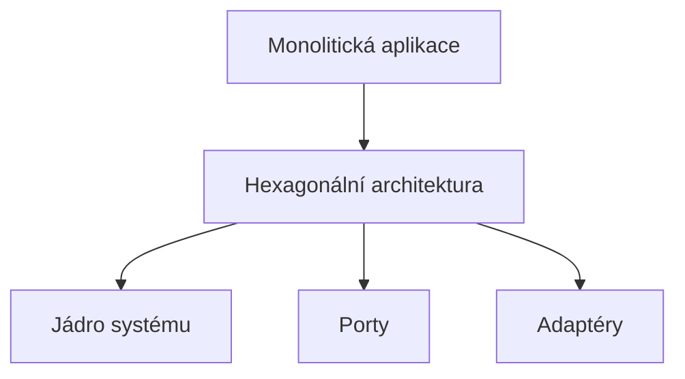
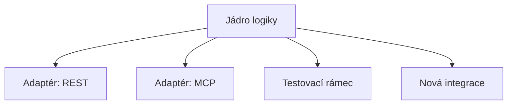

# Hexagonální architektura v MCP: Oddělení domény, portů a adaptérů

**Klíčová slova:** hexagonální architektura, MCP, doménová logika, porty, adaptéry, rozšiřitelnost, testovatelnost

---

## Úvod

Hexagonální (šestiúhelníková) architektura je návrhový vzor, který odděluje doménovou logiku systému od vnějších závislostí, jako jsou databáze, API nebo uživatelská rozhraní. V kontextu MCP ekosystému tento přístup zajišťuje, že jádro systému zůstává čisté, snadno testovatelné a rozšiřitelné.

---

## Hlavní principy

- **Jádro (Core Domain):** Obsahuje hlavní logiku a pravidla systému (např. PromptService).
- **Porty:** Definují rozhraní, přes která jádro komunikuje s okolím (např. úložiště, API).
- **Adaptéry:** Implementují konkrétní technologie (např. PostgreSQL, souborový systém) a připojují je k portům.
- **Transporty:** Zajišťují přenos dat mezi systémem a vnějším světem (např. HTTP, CLI).

---

## Výhody hexagonální architektury v MCP

- **Rozšiřitelnost:** Snadné přidání nových úložišť, API nebo rozhraní bez zásahu do jádra.
- **Testovatelnost:** Doménová logika je izolovaná a lze ji testovat bez závislosti na konkrétních technologiích.
- **Udržitelnost:** Systém je připraven na budoucí změny a rozšíření.

---

## Příklad v MCP

- **Jádro:** PromptService, MutablePrompt, logika správy promptů.
- **Porty:** Rozhraní pro CRUD operace, vyhledávání, konverzi formátů.
- **Adaptéry:** Implementace pro File System, PostgreSQL, MDC.
- **Transporty:** HTTP API, CLI rozhraní, SSE.

---

## Vývoj: Od monolitu k hexagonální architektuře

*Obrázek: Systémy se vyvíjejí od monolitických k modulárním, hexagonálním architekturám pro větší flexibilitu.*

---

## Testovatelnost a rozšiřitelnost

*Obrázek: Hexagonální architektura umožňuje snadné testování a rozšíření pomocí adaptérů a testovacích rámců.*

---

## Závěr

Hexagonální architektura je klíčovým prvkem moderního návrhu MCP serverů. Umožňuje rychlý vývoj, snadné testování a dlouhodobou udržitelnost celého ekosystému. 