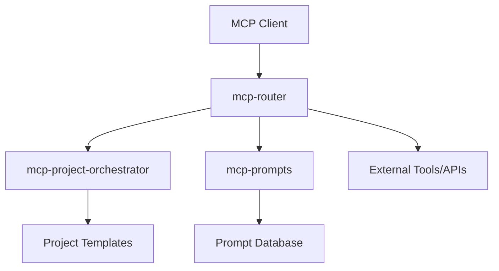
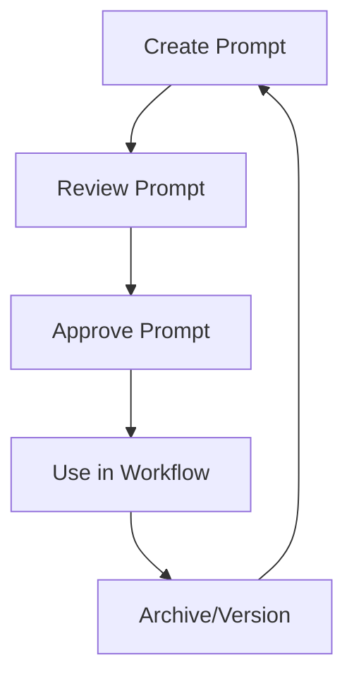

# Strategic Context

The sparesparrow portfolio is more than a collection of open-source projects—it is a unified, forward-looking vision for agentic AI systems. Centered on the Model Context Protocol (MCP), these projects demonstrate leadership in interoperability, developer productivity, and security for the next generation of AI-native software. The portfolio showcases expertise in MCP, agentic workflows, and secure, scalable architectures, positioning its creator as a systems architect ready for leadership in the AI ecosystem.

---

## Portfolio Summary Table

| Repository               | Core Stack                              | Purpose                                              | Strategic Value                                                      |
| ------------------------ | --------------------------------------- | ---------------------------------------------------- | -------------------------------------------------------------------- |
| mcp-project-orchestrator | Python, Poetry, Mermaid, Ruff, mypy     | MCP server for project scaffolding and automation    | Demonstrates agentic workflow, developer productivity, meta-level AI |
| mcp-prompts              | TypeScript, Node.js, Docker, PostgreSQL | Centralized, versioned prompt management             | Enterprise prompt management, RBAC, versioning, production focus     |
| mcp-prompts-rs           | Rust, Cargo, PostgreSQL, Docker         | High-performance, memory-safe MCP prompt server      | Security, performance, Rust for foundational infrastructure          |
| mcp-router               | TypeScript, Python, DevContainer        | Workflow designer and router for agent-based systems | Ambitious orchestration, multi-agent, distributed system vision      |
| rust-network-mgr         | Rust, Netlink, nftables                 | Linux network management service                     | Systems-level expertise, memory safety, operational reliability      |
| cursor-rules             | Markdown (.mdc)                         | Machine-readable rules for AI-assisted coding        | Human-AI collaboration, best practices, knowledge structuring        |

---

## MCP Ecosystem Overview

_Figure: The MCP ecosystem connects clients, routers, orchestrators, prompt servers, and external tools._

---

## Prompt Lifecycle Management

_Figure: Prompts are created, reviewed, approved, used, and archived in a managed lifecycle._

---

# An Analysis of sparesparrow's Contributions to the Model Context Protocol (MCP) Open-Source Ecosystem

## Introduction

The advent of large language models (LLMs) has catalyzed a paradigm shift in software development, moving towards agentic systems that can reason, plan, and interact with external environments. A fundamental challenge in this new era is the lack of a standardized communication layer, forcing developers to create bespoke, brittle integrations for every tool, API, and data source. To address this, Anthropic introduced the Model Context Protocol (MCP) in November 2024, an open-source framework designed to standardize how AI systems integrate with the outside world. Functioning as a "universal translator" or a "USB-C port for AI," MCP provides a common language for AI clients and servers to exchange information, expose tools, and share reusable prompts, thereby solving the complex "N×M" data integration problem that has hindered the development of robust, interoperable AI agents.

Within this nascent and rapidly evolving ecosystem, independent developers play a crucial role in building the foundational tools and reference implementations that drive adoption and demonstrate the protocol's practical value. One such contributor is the developer known as sparesparrow, who has published a suite of sophisticated, open-source projects under this alias on GitHub, npm, and Docker Hub. These projects are not isolated experiments but form a cohesive toolchain that addresses critical, real-world challenges faced by developers building with LLMs and MCP. This report provides an exhaustive, expert-level analysis of sparesparrow's contributions, evaluating their technical architecture, strategic value, and impact on the broader developer community. The analysis will delve into the flagship mcp-prompts server, its expansion into a broader ecosystem of orchestration and routing tools, and the underlying technical proficiency demonstrated across the entire portfolio.

## Portfolio Overview

The scope of sparesparrow's work reveals a developer with a clear vision for enabling more powerful, automated, and maintainable AI development workflows. The portfolio, summarized below, showcases a progression from foundational utilities to more ambitious systems, built with a polyglot skillset and a consistent adherence to modern software engineering principles.

| Repository               | Primary Language(s) | Stated Purpose                                        | GitHub Stars/Forks |
| ------------------------ | ------------------- | ----------------------------------------------------- | ------------------ |
| mcp-prompts              | TypeScript          | MCP server for managing prompts and templates.        | 44 / 9             |
| mcp-project-orchestrator | Python, Shell       | Orchestrates new project creation from templates.     | 10 / 3             |
| mcp-router               | TypeScript, Python  | Workflow designer and router for agent-based systems. | 5 / 0              |
| mcp-prompts-catalog      | JSON                | Single source of truth for mcp-prompts content.       | N/A                |
| mcp-prompts-rs           | Rust                | High-performance Rust rewrite of mcp-prompts.         | 0 / 0              |
| rust-network-mgr         | Rust                | Linux network management and monitoring service.      | N/A                |

## 1. The mcp-prompts Server: A Cornerstone Contribution to AI Development Workflows

### 1.1. Strategic Value: Addressing the "Prompt Rot" Challenge

As development teams increasingly leverage LLMs, they face a new kind of technical debt. Prompts—the carefully crafted instructions that guide model behavior—are often scattered across codebases, buried in shared documents, or lost in chat histories. This disorganization leads to a critical organizational problem that sparesparrow's mcp-prompts-catalog repository explicitly names "prompt rot". This condition is characterized by valuable prompts becoming fragmented, unversioned, and difficult to manage, creating significant friction for teams.

The mcp-prompts server is designed as a direct remedy to this challenge. It establishes a "single source of truth" for all prompts, templates, and their associated metadata, solving several key problems simultaneously:

- **Lack of Versioning:** Without a central system, it is nearly impossible to track changes to prompts, understand why a prompt that worked yesterday is failing today, or revert to a previously functional version. mcp-prompts introduces Git-like versioning capabilities to manage the history of each prompt.
- **Difficult Testing:** When prompts are embedded in application code, testing them in isolation is difficult. Centralizing them in a server allows for standardized testing and validation workflows.
- **Security Risks:** Sharing prompts with sensitive information in insecure channels poses a risk. The server provides a foundation for secure sharing and access control.
- **Inefficient Collaboration:** Fragmentation prevents developers from discovering and reusing effective prompts created by their colleagues. A centralized, searchable repository fosters collaboration and consistency.

The decision to tackle "prompt rot" elevates the project's importance beyond that of a simple utility. In the context of modern software development, the systematic management of assets like code, infrastructure definitions, and machine learning models falls under the umbrella of DevOps and MLOps (Machine Learning Operations). Prompts represent a new, critical class of asset in the AI development lifecycle. By providing a robust system for managing this asset, mcp-prompts functions as an essential piece of MLOps infrastructure for the emerging agentic era. It provides the governance, versioning, and collaboration framework necessary for teams to build scalable and maintainable AI applications, transforming a chaotic process into a managed engineering discipline.

### 1.2. Architectural Deep Dive and Feature Analysis

The server's architecture is thoughtfully designed to be both powerful and flexible, demonstrating a keen understanding of the diverse needs of developers. The feature set goes well beyond simple storage, offering a sophisticated platform for prompt management. Core functionalities include full CRUD (Create, Read, Update, Delete) operations for prompts, exposed as MCP tools like add_prompt, get_prompt, update_prompt, list_prompts, and delete_prompt, alongside capabilities for creating and applying templates with variables and filtering prompts by tags.

Two architectural decisions, in particular, highlight the project's sophistication:

- **Flexible Storage Backends:** Acknowledging that different projects have different requirements, mcp-prompts supports multiple storage adapters. This allows developers to choose the most appropriate backend for their needs:
  - File Adapter: Stores prompts as individual JSON files in a directory, offering a simple, human-readable solution perfect for local development and version control with Git.
  - PostgreSQL Adapter: Stores prompts in a PostgreSQL database, providing a robust, scalable, and production-grade solution for enterprise use cases. The project's dependency on the official @modelcontextprotocol/server-postgres package confirms this deep integration.
  - MDC Adapter: Stores prompts in the .mdc format, ensuring direct compatibility with the "Cursor Rules" feature in the Cursor IDE, a popular tool in the AI coding community.

This architectural choice makes the server highly adaptable, lowering the barrier to entry for developers who can start with a simple file-based setup and seamlessly migrate to a powerful database backend as their needs grow.

- **The MutablePrompt Interface:** Perhaps the most innovative feature of mcp-prompts is the MutablePrompt interface. This powerful abstraction enables the on-the-fly conversion of prompts between multiple formats:
  - JSON Format: The standard internal format used by the server for its core operations.
  - MDC Format: The Cursor Rules Markdown format for direct IDE integration.
  - PGAI Format: A format with embedding support for PostgreSQL AI, enabling powerful vector and semantic search capabilities.
  - Template Format: A dynamic format with variable placeholders for use in templating systems.

This design demonstrates remarkable architectural foresight. The MutablePrompt interface effectively functions as an implementation of the Adapter or Bridge design pattern, creating a clean separation between a prompt's persistent storage format and its application format. A prompt stored as a simple JSON file on the filesystem can, upon request, be served in the PGAI format to an application that needs to perform a vector search, or as an MDC file to a developer using Cursor. This architectural pattern is not merely a convenience; it future-proofs the entire system. As the AI ecosystem evolves and new platforms or IDEs introduce their own proprietary prompt formats, mcp-prompts can be extended to support them by simply implementing a new conversion adapter within the MutablePrompt interface. This can be done without altering the server's core storage or API logic, ensuring the project remains relevant and interoperable in a rapidly changing landscape. This is a clear indicator of a mature and extensible architecture designed for long-term viability.

### 1.3. Distribution, Deployment, and Developer Experience

A key factor in the adoption of any open-source tool is its accessibility and ease of use. sparesparrow has excelled in this area, ensuring that mcp-prompts is easy to install, configure, and integrate. The project is distributed through two primary channels: the npm registry as a package named @sparesparrow/mcp-prompts and Docker Hub as a container image named sparesparrow/mcp-prompts.

The project's documentation provides exceptionally clear, multi-platform installation and usage instructions tailored to different developer workflows:

- **npx Execution:** For developers wanting a quick, dependency-free way to run the server, the npx -y @sparesparrow/mcp-prompts command is recommended. This downloads and runs the package without a permanent installation, which is ideal for testing or simple use cases.
- **Global Installation:** A traditional npm install -g @sparesparrow/mcp-prompts option is provided for those who prefer to have the command-line interface available system-wide.
- **Docker Deployment:** For production or complex environments, detailed docker run commands are provided, including examples for mounting volumes for persistent data storage.

Furthermore, the documentation includes specific, copy-paste-ready JSON configuration snippets for integrating the server with popular MCP clients like the Claude Desktop app. This meticulous attention to developer experience significantly lowers the barrier to adoption and demonstrates a commitment to making the tool as usable as possible.

However, a comprehensive analysis must also consider the practical realities of software maintenance. The project's npm page provides a crucial piece of real-world context that complements the polished presentation of the GitHub README. It features a "Critical Alert" warning users that recent versions of the package may have a critical runtime error and that the Docker images have a build issue. The alert recommends using a specific, stable older version (1.2.22) or building the project from source. This transparency is not a sign of failure but rather a hallmark of a responsible and trustworthy open-source maintainer. It acknowledges the challenges of a rapidly evolving project, prioritizes user stability over silently pushing potentially broken code, and provides clear, actionable workarounds. This honest communication is vital for building and maintaining community trust.

### 1.4. Project Evolution: The Rust Rewrite and Decoupled Catalog

The mcp-prompts ecosystem is not static. Recent developments show a significant architectural evolution, as sparesparrow has begun refactoring the original monolithic project into a more modular, multi-component platform. This is evidenced by the creation of two new repositories: mcp-prompts-rs and mcp-prompts-catalog.

- **mcp-prompts-rs:** This repository contains a complete rewrite of the prompt server in the Rust programming language. The project's README explicitly acknowledges the original TypeScript implementation and aims to replicate its core functionality, including prompt management, template support, and multiple storage backends (File System and PostgreSQL). The choice of Rust is strategic, aiming to leverage the language's well-known strengths in performance, memory safety, and superior concurrency handling, which are highly desirable for a server application intended for production use.
- **mcp-prompts-catalog:** This repository represents a classic and powerful software design decision: the separation of concerns. It decouples the content (the prompts themselves, stored in a standardized JSON format) from the server logic. This architectural separation offers numerous advantages. The server engine can be updated, patched, or even completely replaced without affecting the curated collection of prompts. Conversely, the prompt catalog can be versioned, updated, and distributed independently of the server implementation.

This refactoring from a single project into a three-part ecosystem (mcp-prompts as the stable TypeScript version, mcp-prompts-rs as the next-generation performance core, and mcp-prompts-catalog as the independent content repository) signifies a profound maturation of the developer's vision. This is not merely a code cleanup; it is a strategic transformation of a successful project into a foundational, extensible platform. This modular architecture paves the way for wider community contribution and adoption. For example, it would now be straightforward for another developer to build a new prompt server in Python or Go that consumes the official mcp-prompts-catalog, thereby expanding the ecosystem while maintaining a standard for the prompt data itself. This move indicates a shift from building a tool to architecting a platform.

## 2. Expanding the Ecosystem: Tools for Orchestration and Routing

Building on the foundation of the mcp-prompts server, sparesparrow has developed additional projects that expand the scope from managing a single asset type to orchestrating the entire software development lifecycle. These tools, mcp-project-orchestrator and mcp-router, demonstrate a clear and ambitious vision for a fully integrated, AI-assisted development environment powered by MCP.

### 2.1. mcp-project-orchestrator: Automating Project Scaffolding

The mcp-project-orchestrator project represents a significant step "up the stack" in terms of ambition and capability. Written primarily in Python, a dominant language in the AI/ML space, this tool is described as a "comprehensive project orchestration tool for managing Model Context Protocol (MCP) projects". Its core purpose is to automate the creation of new software projects by analyzing a user's request, identifying suitable design patterns and templates, and then scaffolding the initial file structure.

The project's functionality is intelligently partitioned into three key areas:

1. **Template Management:** This module handles the core scaffolding logic, providing project and component templates with support for variable substitution, validation, and versioning. This allows for the creation of standardized, best-practice project starters (e.g., for a FastAPI application).
2. **Prompt Management:** This component manages system and user prompt templates, enabling the orchestrator to use LLMs effectively for its own internal reasoning or to generate content for the new project.
3. **Mermaid Diagram Generation:** A particularly insightful feature is the integration with Mermaid for generating diagrams. This allows the orchestrator to automatically create flowcharts, sequence diagrams, and class diagrams as part of the project scaffolding, providing instant, valuable documentation for the newly created codebase.

The use of modern, high-quality Python development tools such as Poetry for dependency management, Ruff for linting, and mypy for static type checking further underscores a commitment to software craftsmanship.

The mcp-project-orchestrator fully embodies the agentic promise of MCP. It is designed to be a tool that an LLM can use to perform a complex, multi-step, and high-value task: "create a new, well-structured software project based on my requirements." This moves beyond simple data retrieval or single-action tools and into the realm of genuine workflow automation, showcasing a sophisticated understanding of how MCP can be leveraged to build powerful developer agents.

### 2.2. mcp-router: A Vision for Agentic Workflows

The mcp-router project is the most forward-looking and ambitious piece of the ecosystem. It is described as both a "robust workflow designer and router for agent-based systems" and a "comprehensive system monitoring solution". This suggests a dual purpose: not only directing traffic between MCP clients and servers but also providing the intelligence to design and monitor the complex workflows executed by AI agents.

Architecturally, the project is a full-stack, polyglot application. It utilizes TypeScript and Node.js for the backend server, React for the frontend user interface, and a shared package for common types and utilities that can be used in both environments. This structure is indicative of a developer with broad skills across the entire web stack. The project is designed from the ground up for containerized development and deployment, with first-class support for VS Code DevContainers and Docker Compose.

It is important to place this project within the context of the broader MCP ecosystem. The term "MCP Router" is a common one, and several other popular open-source implementations exist, such as the nacos-mcp-router (which focuses on service discovery via Nacos), the mcp-router/mcp-router (a desktop application for managing server connections), and chatmcp/mcprouter (a Go-based API proxy). These routers primarily focus on the infrastructural tasks of proxying, discovery, and management. sparesparrow's implementation appears to differentiate itself with its stated focus on "cognitive workflows". This implies an intention to build a more intelligent routing layer that actively participates in the agent's reasoning process, perhaps by orchestrating sequences of tool calls or dynamically selecting servers based on task semantics, rather than simply forwarding requests. While the project appears to be in a more nascent stage of development compared to mcp-prompts, its vision is compelling and points toward the future of multi-agent systems.

### 2.3. A Synergistic Toolchain: Documented Interoperability

The true power of sparesparrow's contributions lies not in the individual projects, but in their deliberate design for interoperability. These are not standalone tools but components of an integrated system, a fact that is explicitly and thoroughly documented. The README for the core mcp-prompts project contains a dedicated "MCP Server Integration" section that provides clear instructions and examples for integrating with the Orchestrator Server and the MCP Router.

This commitment to integration is made concrete through the inclusion of a "Docker Compose for Full Integration" use case. This provides developers with a single command to launch the entire suite of servers, creating a unified, pre-configured development environment where all components can communicate with each other. This is not an accidental feature; it is the tangible output of a cohesive and deliberate system design.

This integrated architecture effectively creates a "platform of platforms" for AI-assisted software development. In this system, each server plays a specialized role, analogous to a team of collaborating agents:

- The mcp-prompts server acts as the central "memory" or "knowledge base," providing the standardized instructions and templates that guide behavior across the system.
- The mcp-project-orchestrator acts as the "factory" or "builder agent," capable of executing the complex task of creating new software artifacts.
- The mcp-router is envisioned as the "central nervous system" or "conductor agent," responsible for understanding user intent, designing workflows, and delegating tasks to the appropriate specialized server.

A hypothetical workflow illustrates this power: A developer could issue a high-level command to the mcp-router. The router, in turn, could fetch a workflow prompt from the mcp-prompts server to understand that the user's intent is to "create a new project." It would then delegate this task to the mcp-project-orchestrator. The orchestrator would execute its function, potentially calling back to the mcp-prompts server to fetch more specialized templates (e.g., a .gitignore template for Python), and report its success back to the router. This vision of an integrated, multi-agent system for the software development lifecycle is far more powerful than the sum of its individual parts and provides a compelling blueprint for the future of the field.

## 3. Profile of a Polyglot Developer: Demonstrating Technical Breadth and Best Practices

An analysis of the complete portfolio reveals a profile of sparesparrow as a highly skilled, versatile, and disciplined software engineer. The quality and nature of the projects demonstrate a deep technical proficiency that extends beyond the MCP ecosystem itself, coupled with a consistent commitment to the best practices that define modern, high-quality software development.

### 3.1. Beyond MCP: A Case Study in Systems Programming with rust-network-mgr

The rust-network-mgr repository is a critical piece of evidence when assessing the depth of sparesparrow's technical capabilities. This project is a pure systems-level utility, written in Rust, and is entirely independent of the Model Context Protocol. Its purpose is to provide a network management service for Linux systems, a task that requires deep, low-level expertise.

The service's functionality includes:

- **Low-Level Network Monitoring:** It directly interacts with the Linux kernel's networking subsystem via rtnetlink to detect IP address changes on network interfaces in real-time.
- **Dynamic Firewall Management:** It automatically updates IP sets within the Linux nftables firewall based on the detected network changes, using the rustables crate for atomic and reliable updates.
- **Container Integration:** It features an optional module that connects directly to the Docker daemon's Unix socket (/var/run/docker.sock) using the bollard Rust crate. This allows it to monitor Docker container lifecycle events (start, stop, die) and track their IP addresses.

The existence and sophistication of this project provide invaluable context for the rest of the portfolio. It establishes that sparesparrow's decision to rewrite mcp-prompts in Rust is not a superficial choice based on industry trends. Instead, it is a decision rooted in pre-existing, demonstrated expertise in Rust and its application to high-performance systems programming. This foundational skill set strongly suggests that the resulting mcp-prompts-rs server will be architecturally sound, performant, and reliable, built by a developer who understands the language's nuances and strengths from firsthand experience.

### 3.2. A Commitment to Modern Software Engineering Best Practices

Across every repository in the portfolio, there is a consistent and disciplined application of the principles and practices that characterize high-quality, modern software engineering.

- **Polyglot Proficiency:** The work showcases strong, idiomatic command of a diverse set of languages and technologies. This includes TypeScript for full-stack web development (Node.js backend, React frontend), Python for AI and scripting (with modern tooling like Poetry and Ruff), Rust for high-performance systems programming, and Shell scripting for automation and operational tasks. This versatility allows the developer to choose the right tool for each job.
- **Comprehensive Containerization:** All major projects are built with containerization as a first-class concern. The use of Docker and detailed Docker Compose files for different environments (development, production, testing, and full integration) demonstrates a mature DevOps mindset and ensures that the projects are portable, reproducible, and easy to deploy.
- **Robust CI/CD and Automation:** The presence of .github/workflows directories and commit messages related to improving CI/CD pipelines across multiple repositories is clear evidence of a commitment to automated testing, building, and integration. This practice is essential for maintaining code quality and release velocity in complex projects.
- **Clear and Thorough Documentation:** A standout characteristic of the portfolio is the exceptional quality of the documentation. The README files for each project are extensive, well-structured, and meticulously detailed. They consistently provide clear installation guides for multiple platforms, comprehensive configuration options, API usage examples, architectural overviews, and development workflows. This dedication to documentation is a vital contribution to the open-source community, as it dramatically lowers the barrier for other developers to use, understand, and contribute to the projects.
- **Adherence to Open Standards:** All projects are released under the permissive MIT License, which encourages maximum adoption, modification, and contribution from the community. This commitment to open-source principles is fundamental to building a healthy ecosystem around the work.

## 4. Impact, Recognition, and Concluding Analysis

The final measure of any open-source contribution is its impact on the community it serves. An evaluation of sparesparrow's work indicates a growing influence within the specialized field of MCP development, achieved through the creation of high-utility tools that have gained visibility and validation from third-party platforms and organic community discovery.

### 4.1. Measuring Community Impact and Visibility

The impact of sparesparrow's work can be assessed through both quantitative and qualitative measures.

- **Quantitative Metrics:** The flagship project, mcp-prompts, exhibits solid community traction, having garnered 44 stars and 9 forks on GitHub. The corresponding npm package, @sparesparrow/mcp-prompts, has been actively maintained, with numerous versions published up to 3.0.1, indicating an ongoing development and release cycle. On Docker Hub, the sparesparrow/mcp-prompts repository features a variety of tags for latest, dev, test, and specific version numbers, which is indicative of a robust and professional release process. While public pull statistics for Docker Hub are not available in the provided materials, the existence of this structured release pipeline is itself a positive indicator.
- **Qualitative Recognition:** Perhaps more significantly, the projects have achieved recognition and visibility on platforms beyond sparesparrow's direct control.
  - Inclusion in MCP Server Hubs: Both mcp-prompts (as "Prompt Manager") and mcp-project-orchestrator are listed on curated MCP server directories like Glama.ai and Playbooks.com. Inclusion on these hubs acts as a form of third-party endorsement, increasing the projects' discoverability and lending them credibility within the community.
  - Organic Community Discussion: There is evidence of grassroots discovery of the work. A user on the r/ClaudeAI subreddit, for instance, independently found the mcp-prompts GitHub repository while searching for solutions to manage complex prompting workflows and shared it with the community, noting they planned to try it. This type of organic mention is a strong signal that the project is addressing a genuine need and is being discovered by its target audience.

While the absolute star counts may not rival those of the largest, most generalized open-source projects, the combination of steady metrics, active maintenance, and inclusion in specialized community hubs demonstrates that sparesparrow's work is recognized as a significant and valuable contribution within the focused and still-growing community of MCP developers. The impact is less about mass-market fame and more about providing foundational, high-utility tools for a specialized domain.

### 4.2. Concluding Assessment

The evidence overwhelmingly supports the conclusion that sparesparrow is a highly skilled, prolific, and impactful independent contributor to the Model Context Protocol open-source ecosystem. Their work is not a random collection of utilities but a thoughtfully architected and integrated toolchain designed to empower developers building the next generation of AI applications.

The contributions are characterized by a clear strategic vision that progresses logically from solving a foundational, practical problem ("prompt rot" with mcp-prompts) to architecting a comprehensive system for AI-assisted software development (mcp-project-orchestrator, mcp-router). This work is executed with a high degree of technical excellence, demonstrating polyglot programming capabilities, deep systems-level knowledge, and an unwavering commitment to modern software engineering best practices, most notably in the areas of documentation, containerization, and automated CI/CD.

The ongoing evolution of the flagship mcp-prompts project—from a TypeScript monorepo into a modular, multi-repository, multi-language platform centered around a high-performance Rust core and a decoupled content catalog—is a particularly strong indicator of architectural maturity and long-term strategic thinking. This positions the work not just as a set of useful tools, but as a foundational platform upon which the broader community can build.

### 4.3. Strategic Recommendations

Based on this comprehensive analysis, the following strategic recommendations are offered to further enhance the impact and adoption of sparesparrow's work:

1. **Address and Clarify Stability Concerns:** The "Critical Alert" on the mcp-prompts npm page regarding runtime and build issues is a point of friction for new users. It is recommended to prioritize resolving these issues in the TypeScript package. Additionally, updating the main project README to clearly communicate the current status and recommended usage of the TypeScript version versus the in-development Rust version would provide essential clarity for the community. This could involve officially designating the TypeScript version as a "legacy" or "stable" branch while directing new development efforts towards the Rust rewrite.
2. **Accelerate the Rust Transition:** Given the demonstrated expertise in Rust (rust-network-mgr) and the clear performance and safety benefits of the language for this use case, focusing development resources on bringing mcp-prompts-rs to full feature parity with the TypeScript version would be a powerful strategic move. A stable, high-performance Rust implementation would likely become the de facto reference standard for this type of MCP server, attracting significant community interest.
3. **Formalize and Promote the "Toolchain" Narrative:** While the integration between the projects is well-documented internally, there is an opportunity to market them more explicitly as a cohesive, integrated "stack" or "toolchain" for MCP development. This could take the form of a simple landing page, a blog post series, or a meta-repository on GitHub that explains the overarching vision of the integrated system and provides a single, unified guide for setting up the full environment. This would help users understand the synergistic value proposition, which is greater than the sum of the individual tools.
4. **Amplify Community Engagement and Thought Leadership:** The projects are already being discovered organically. Proactive engagement could significantly amplify this reach. This could involve authoring tutorials or technical blog posts (in the vein of other community-written guides) that showcase the power of the integrated toolchain for solving specific, complex problems. Engaging more directly in community forums, such as the r/mcp subreddit where developers are actively discussing prompt management and tool orchestration, would also be an effective way to share expertise, gather feedback, and establish sparesparrow as a key thought leader in the practical application of the Model Context Protocol.

---

_Works cited:_

1. Model Context Protocol - Wikipedia, https://en.wikipedia.org/wiki/Model_Context_Protocol
2. Unlocking the power of Model Context Protocol (MCP) on AWS | Amazon Web Services, https://aws.amazon.com/blogs/machine-learning/unlocking-the-power-of-model-context-protocol-mcp-on-aws/
3. What is Model Context Protocol (MCP)? - IBM, https://www.ibm.com/think/topics/model-context-protocol
4. Model Context Protocol: Introduction, https://modelcontextprotocol.io/introduction
5. sparesparrow/mcp-prompts: Model Context Protocol server for managing, storing, and providing prompts and prompt templates for LLM interactions. - GitHub, https://github.com/sparesparrow/mcp-prompts
6. @sparesparrow/mcp-prompts - npm, https://www.npmjs.com/package/@sparesparrow/mcp-prompts
7. MCP Prompts - Collection - GitHub, https://github.com/sparesparrow/mcp-prompts-catalog
8. Prompt Manager MCP server for AI agents - Playbooks, https://playbooks.com/mcp/sparesparrow-prompt-manager
9. MCP Prompts Server - Glama, https://glama.ai/mcp/servers/@sparesparrow/mcp-prompts
10. @modelcontextprotocol/server-postgres - npm, https://www.npmjs.com/package/@modelcontextprotocol/server-postgres?activeTab=dependents
11. @sparesparrow/mcp-prompt-manager - npm, https://www.npmjs.com/package/@sparesparrow/mcp-prompt-manager?activeTab=dependencies
12. @sparesparrow/mcp-prompts - npm Package Security Analysis -, https://socket.dev/npm/package/@sparesparrow/mcp-prompts
13. Image Layer Details - sparesparrow/mcp-prompts:1.2.20 | Docker Hub, https://hub.docker.com/layers/sparesparrow/mcp-prompts/1.2.20/images/sha256-c112b41147219ae3889ed56415b7a0f2e642c22e6ed93a6faeaf57f403835b1a
14. sparesparrow/mcp-prompts - Docker Image, https://hub.docker.com/r/sparesparrow/mcp-prompts
15. sparesparrow/mcp-prompts-rs: Rust-based server for managing AI prompts using the Model Context Protocol (MCP) - GitHub, https://github.com/sparesparrow/mcp-prompts-rs
16. sparesparrow/rust-network-mgr: Linux based network management, packet routing and LAN peers IP monitoring service written in Rust. - GitHub, https://github.com/sparesparrow/rust-network-mgr
17. sparesparrow/mcp-prompts-catalog - Workflow runs - GitHub, https://github.com/sparesparrow/mcp-prompts-catalog/actions
18. sparesparrow/mcp-project-orchestrator: Analyze user input ... - GitHub, https://github.com/sparesparrow/mcp-project-orchestrator
19. MCP Project Orchestrator - Glama, https://glama.ai/mcp/servers/sparesparrow/mcp-project-orchestrator
20. sparesparrow/mcp-router: A comprehensive system ... - GitHub, https://github.com/sparesparrow/mcp-router
21. nacos-group/nacos-mcp-router - GitHub, https://github.com/nacos-group/nacos-mcp-router
22. mcp-router/mcp-router: The MCP manager. Easily manage your MCP servers with enhanced security and customizability - GitHub, https://github.com/mcp-router/mcp-router
23. chatmcp/mcprouter: api router for MCP Servers - GitHub, https://github.com/chatmcp/mcprouter
24. MCP Router - GitHub, https://github.com/mcp-router
25. sparesparrow/mcp-prompts Tags - Docker Hub, https://hub.docker.com/r/sparesparrow/mcp-prompts/tags
26. Project Orchestrator MCP server for AI agents - Playbooks, https://playbooks.com/mcp/sparesparrow-project-orchestrator
27. I just use API for system prompt, alternatives? - ClaudeAI - Reddit, https://www.reddit.com/r/ClaudeAI/comments/1jd3zdb/i_just_use_api_for_system_prompt_alternatives/
28. MCP Prompts Explained (including how to actually use them) | by Laurent Kubaski - Medium, https://medium.com/@laurentkubaski/mcp-prompts-explained-including-how-to-actually-use-them-9db13d69d7e2
29. "Building MCP Servers: Part 3 — Adding Prompts | by Christopher Strolia-Davis | Medium, https://medium.com/@cstroliadavis/building-mcp-servers-13570f347c74
30. How to use "prompts"? - mcp - Reddit, https://www.reddit.com/r/mcp/comments/1kq88xf/how_to_use_prompts/
31. MCP Clients - best practices for prompts - Reddit, https://www.reddit.com/r/mcp/comments/1lnf32b/mcp_clients_best_practices_for_prompts/
32. Learning MCP : What is the use of prompts coming from the server? - Reddit, https://www.reddit.com/r/mcp/comments/1jtfnlh/learning_mcp_what_is_the_use_of_prompts_coming/
