# Mermaid Diagram Test Page

This page demonstrates the comprehensive Mermaid diagram capabilities of the
sparrow-ai-tech platform.

## Flowchart Example

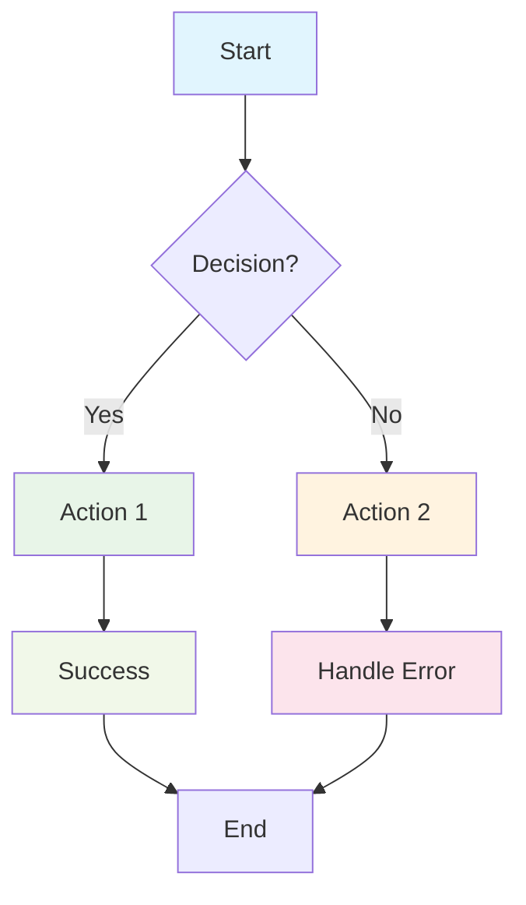

## Sequence Diagram Example

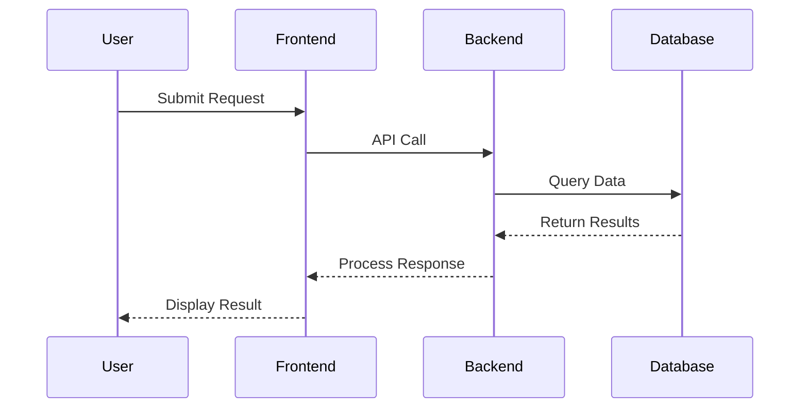

## Class Diagram Example

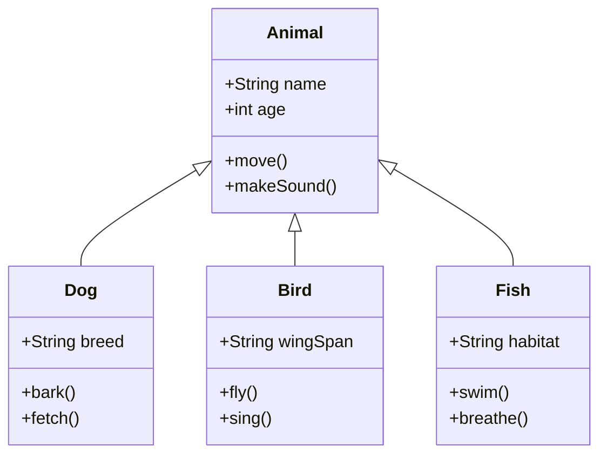

## Gantt Chart Example

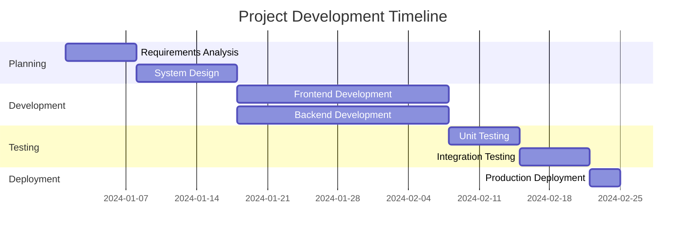

## State Diagram Example

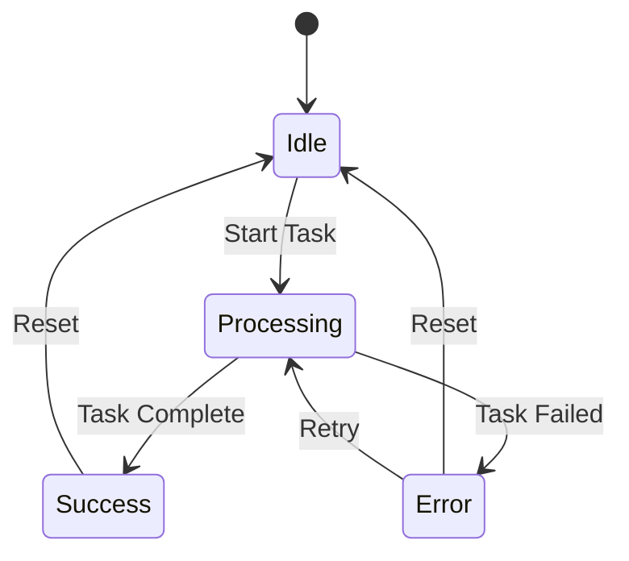

## Entity Relationship Diagram Example

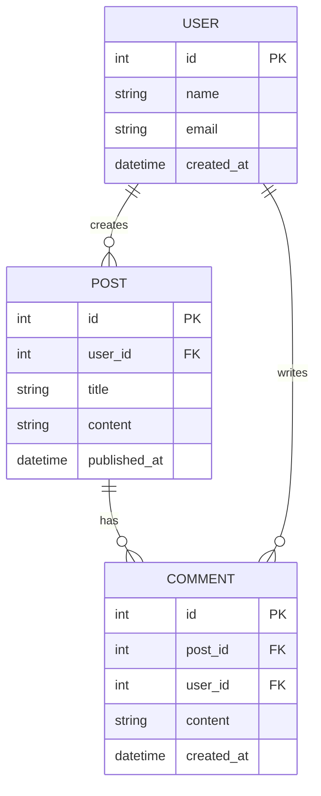

## Pie Chart Example

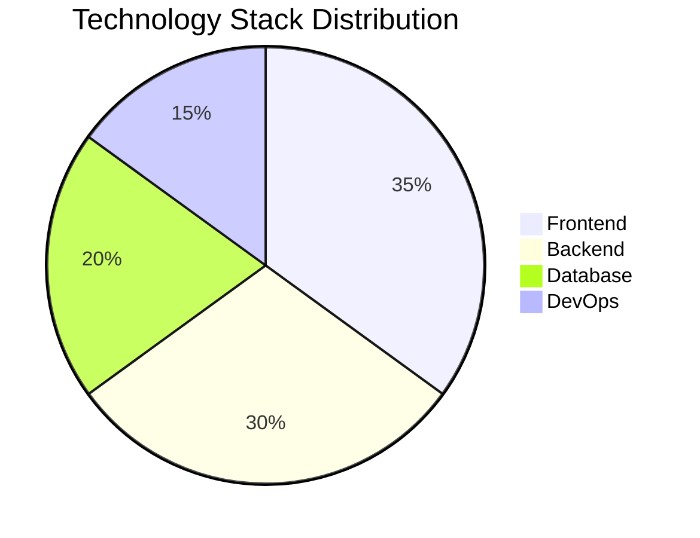

## Git Graph Example

```mermaid
gitgraph
    commit
    branch develop
    checkout develop
    commit
    commit
    checkout main
    merge develop
    commit
```

## Journey Diagram Example

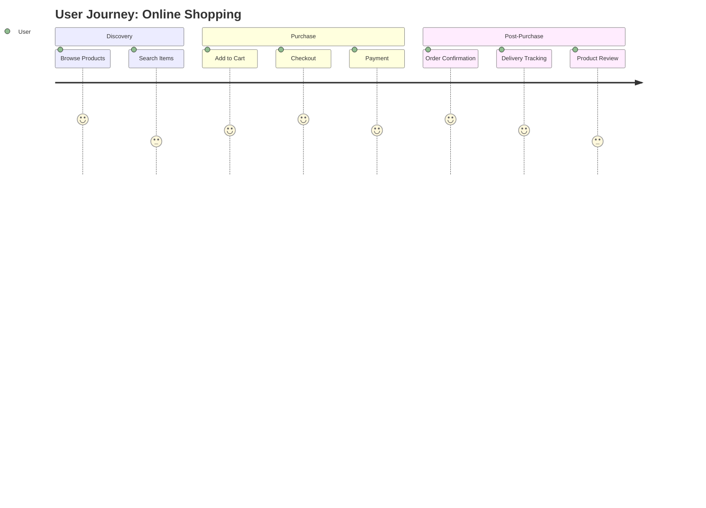

## Mindmap Example

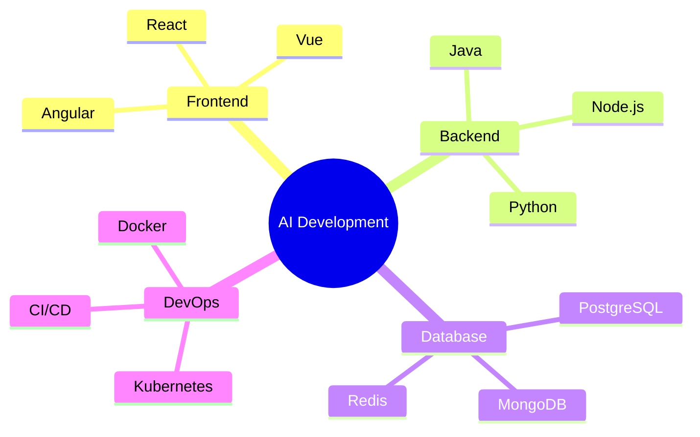

## Timeline Example

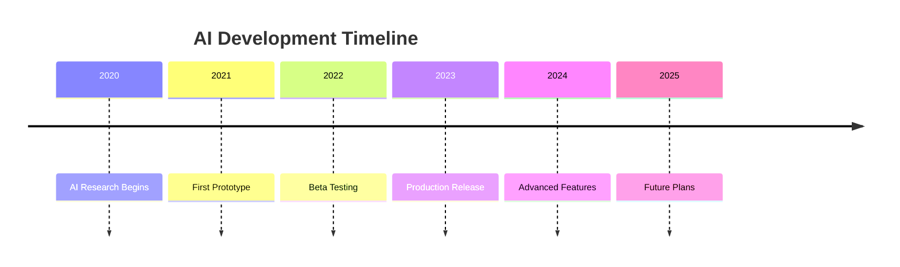

## C4 Context Diagram Example

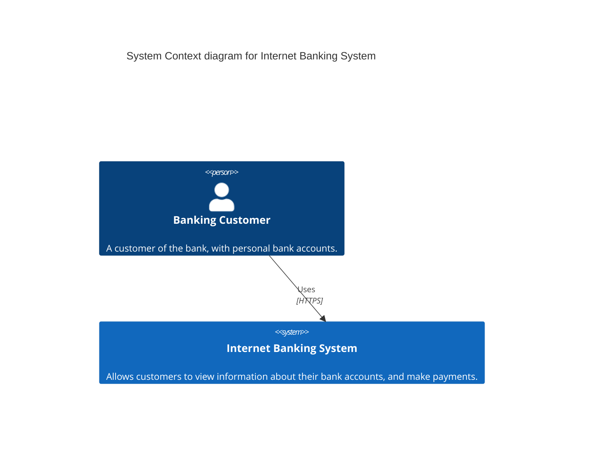

## Editable Diagram Example

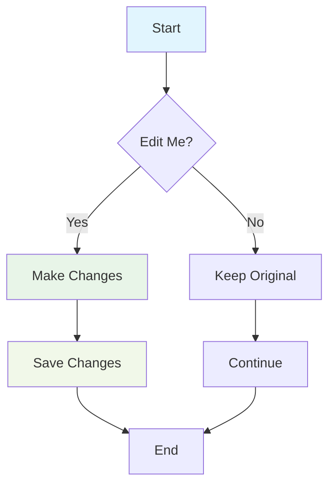

## Complex Workflow Example

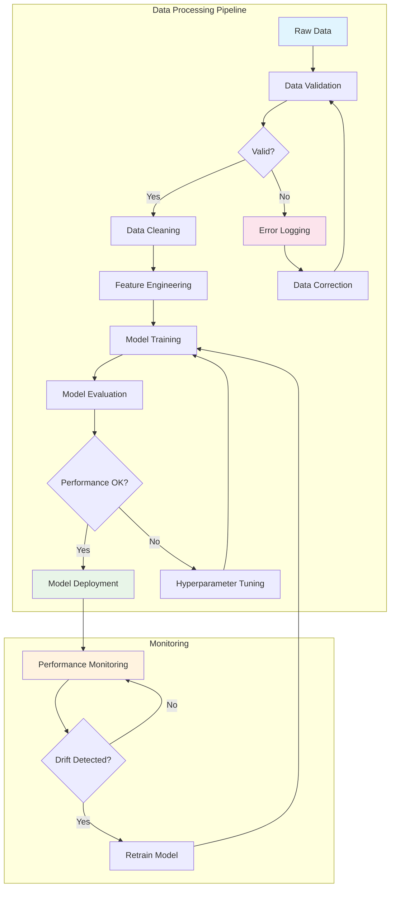

## Security Architecture Example

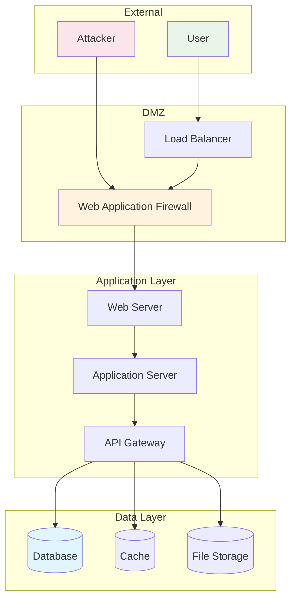

## Microservices Architecture Example

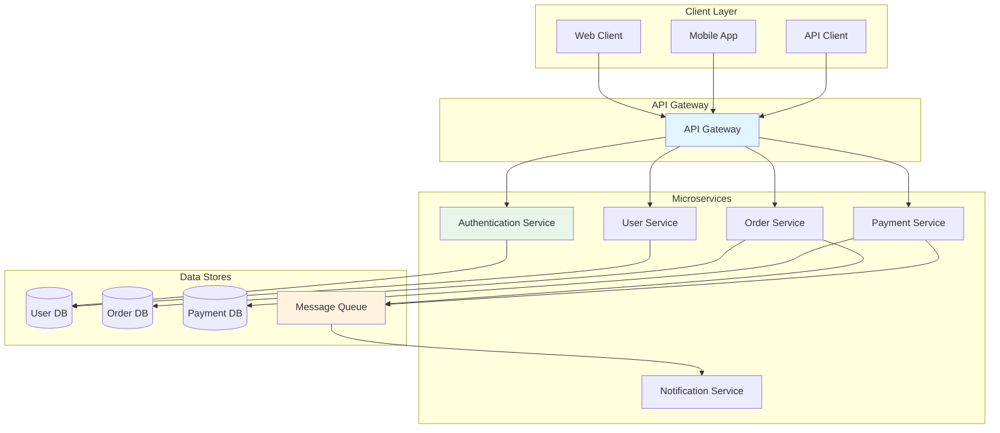

This comprehensive test page demonstrates the full range of Mermaid diagram
capabilities available in the sparrow-ai-tech platform. Each diagram type
showcases different aspects of diagram creation and can be used as templates for
your own diagrams.
