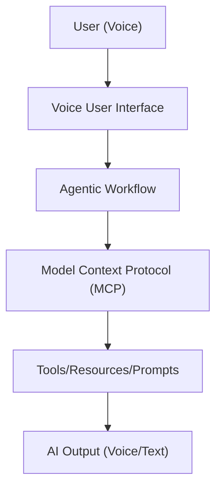
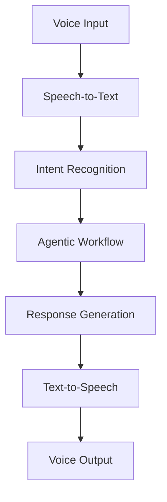
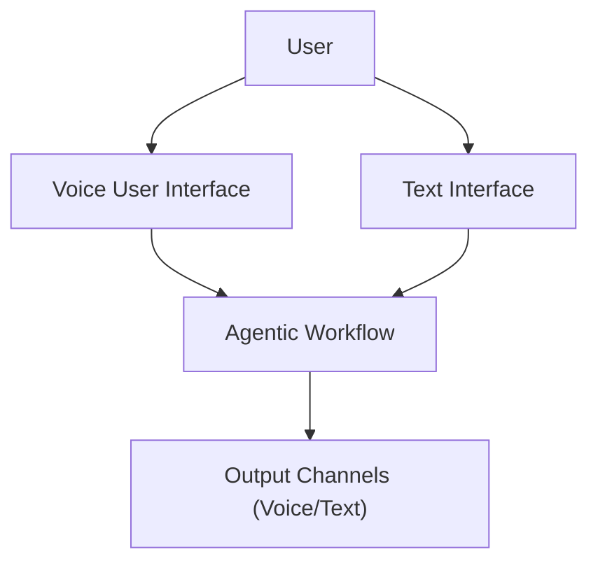
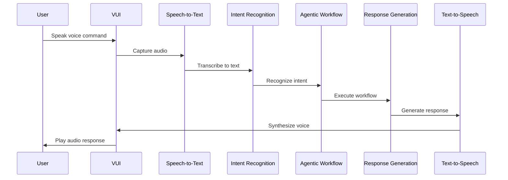
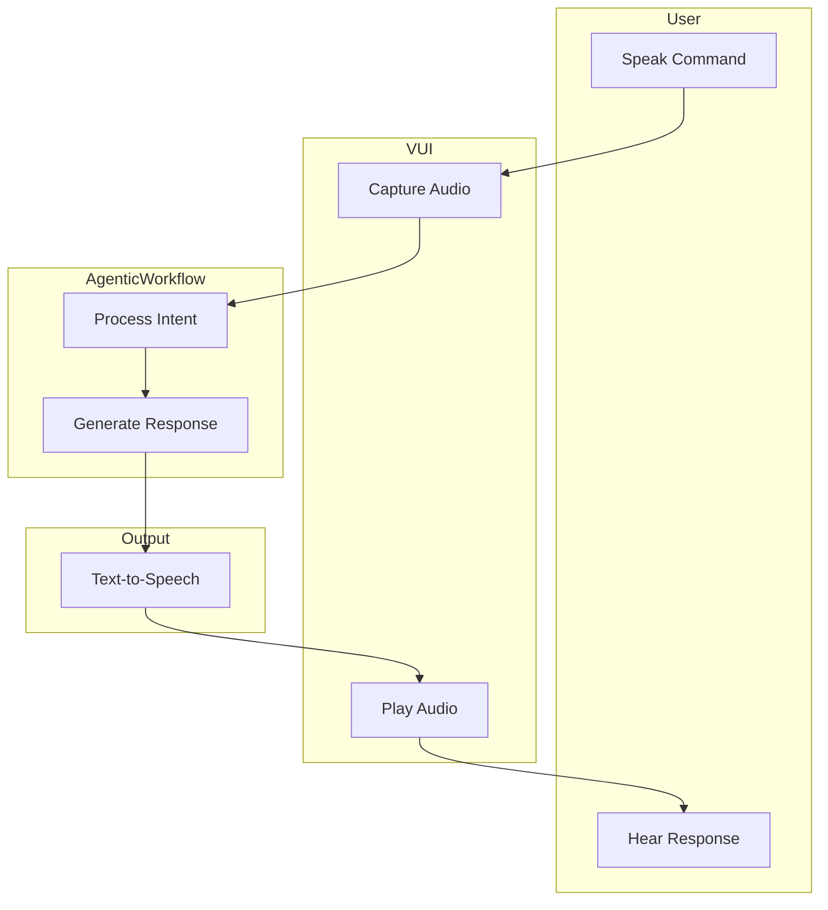

# Portfolio Relevance

This article is part of the sparesparrow/Sparrow AI & Tech portfolio, which is dedicated to building robust, secure, and interoperable agentic AI systems. The VUI (Voice User Interface) revolution is a key enabler for natural, accessible, and powerful interactions with agentic workflows and MCP-based AI ecosystems. Integrating VUI with agentic AI unlocks new user experiences and broadens the impact of intelligent systems.

---

## VUI in the Agentic MCP Ecosystem

_Figure: VUI enables natural interaction with agentic workflows and MCP-based AI systems, expanding accessibility and impact._

---

## VUI Processing Pipeline

_Figure: The VUI processing pipeline from user voice input to agentic workflow and synthesized voice output._

---

## Multi-Modal Interaction

_Figure: Users can interact with agentic workflows via both voice and text interfaces, with multi-modal output._

---

## VUI Interaction Sequence

_Figure: Sequence of a full VUI interaction from user speech to agentic response._

---

## VUI Swimlane: Responsibilities in Voice Interaction

_Figure: Swimlane diagram showing responsibilities in a VUI voice interaction._

---

# VUI Revolution

This article will be available soon.
